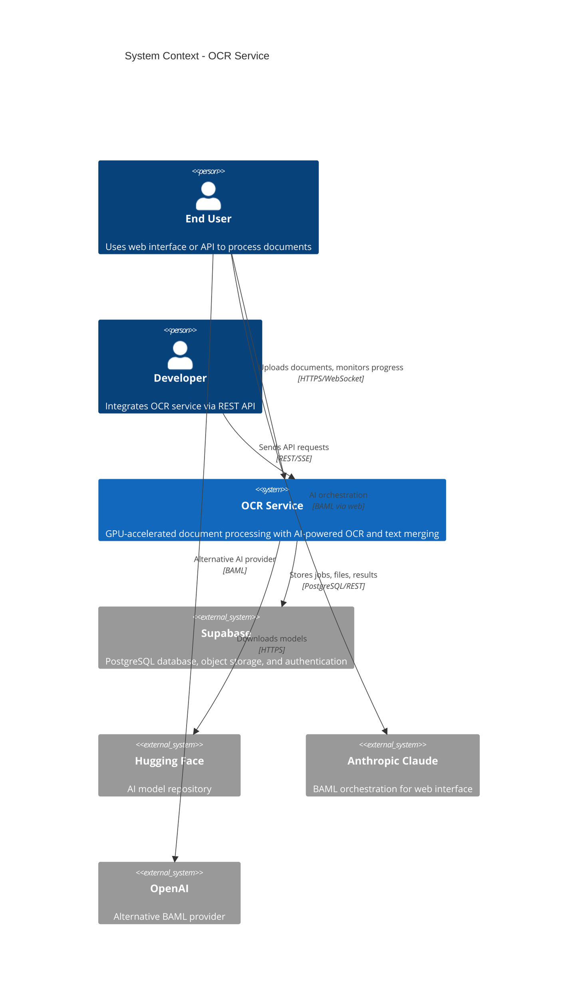
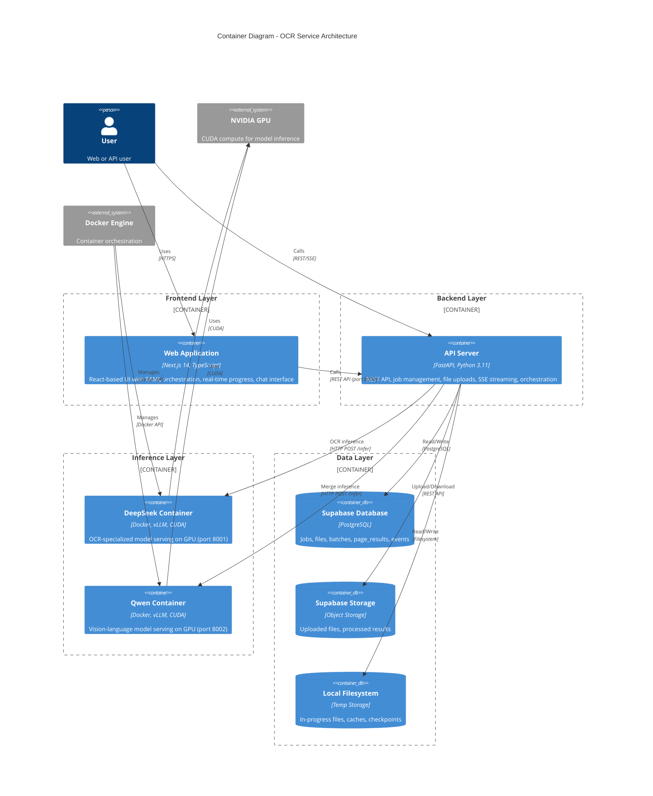
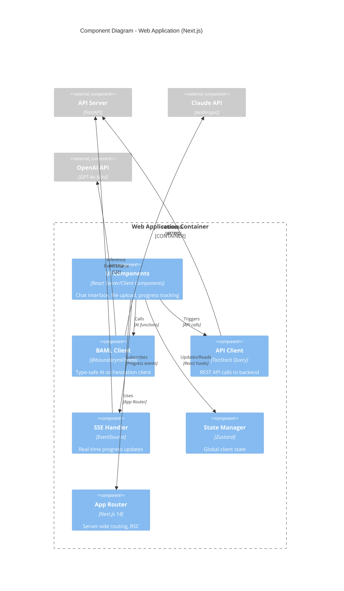
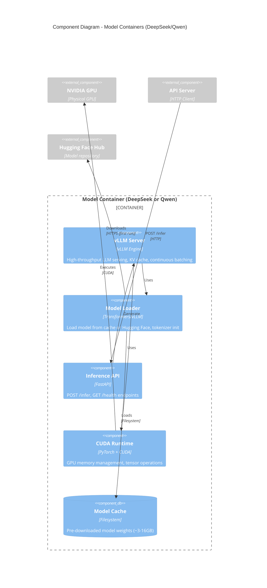
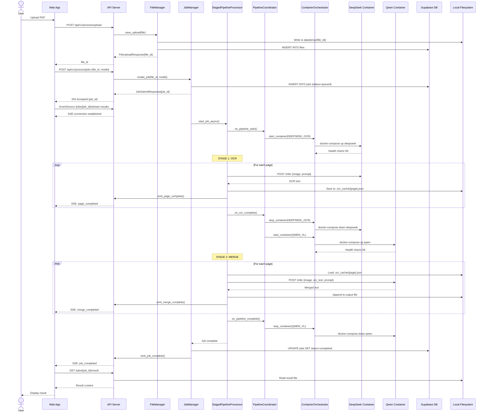
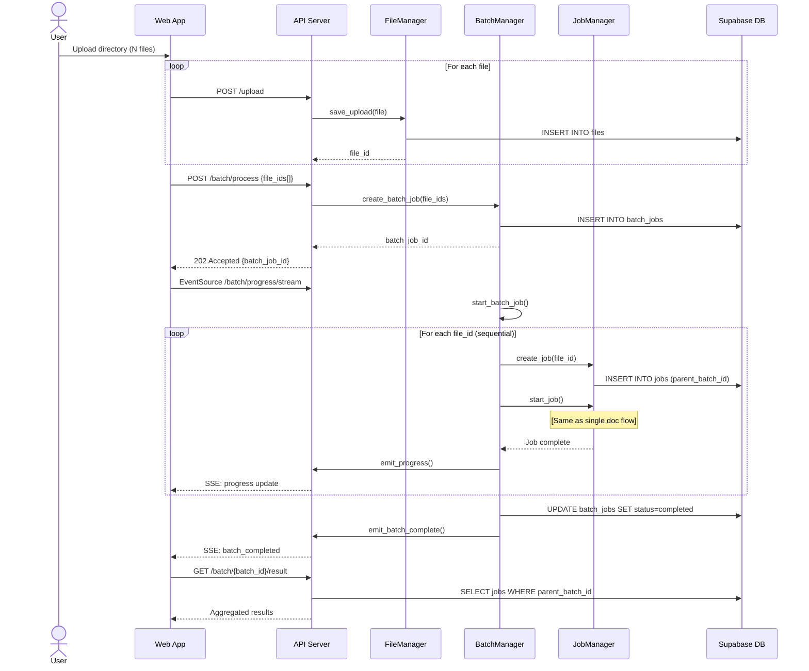
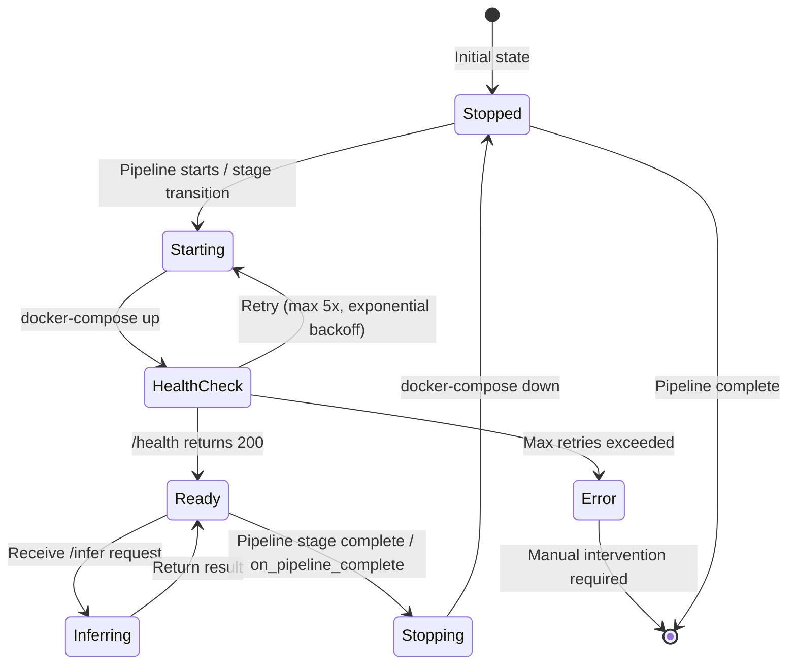
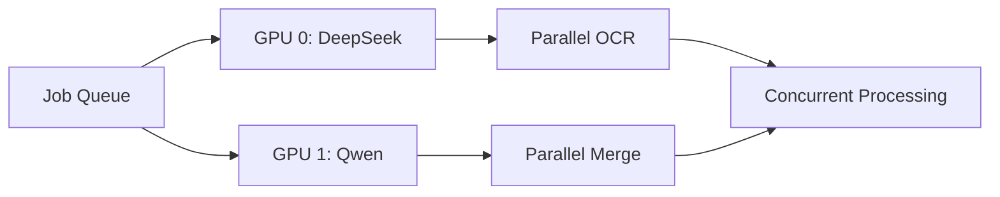
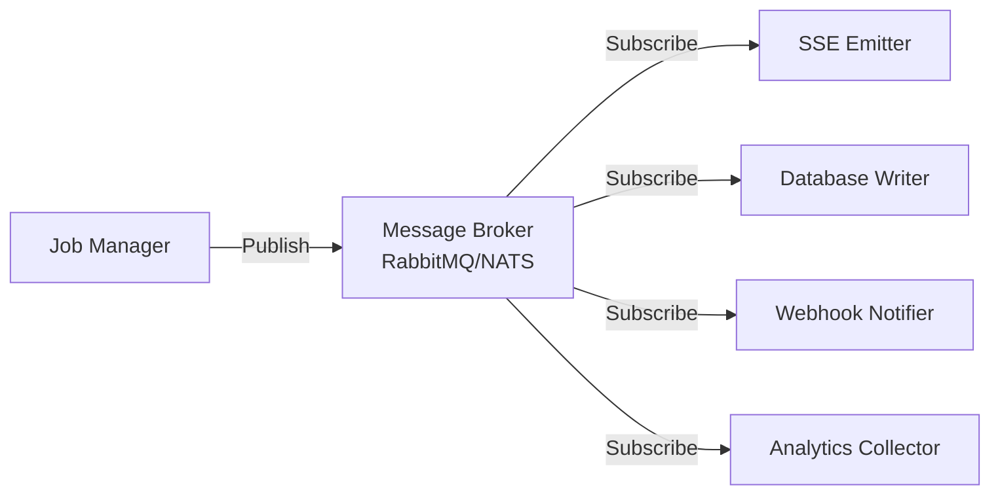

# C4 Architecture Overview: OCR Service

**Version:** 1.0
**Date:** 2025-11-16
**Purpose:** Comprehensive architectural documentation for refactoring and pipeline integration

---

## Table of Contents

1. [System Context (Level 1)](#level-1-system-context)
2. [Container View (Level 2)](#level-2-container-view)
3. [Component Views (Level 3)](#level-3-component-views)
   - [Web Application Components](#31-web-application-components)
   - [API Server Components](#32-api-server-components)
   - [Model Container Components](#33-model-container-components)
   - [Database Components](#34-database-components)
4. [Key Data Flows](#4-key-data-flows)
5. [Integration Patterns](#5-integration-patterns)
6. [Technology Stack](#6-technology-stack)

---

## Level 1: System Context

The OCR Service is a containerized, GPU-accelerated document processing system that converts PDF documents and images into structured text using advanced vision-language models.



### External Actors

| Actor | Type | Interaction | Purpose |
|-------|------|-------------|---------|
| **End User** | Person | Web UI (port 3000) | Upload documents, monitor processing, download results |
| **Developer** | Person | REST API (port 8000) | Integrate OCR into applications |
| **Supabase** | System | PostgreSQL + Storage | Persist jobs, files, metadata; Store uploaded/processed files |
| **Hugging Face** | System | Model Hub | Download pre-trained models (DeepSeek-OCR, Qwen3-VL) |
| **Anthropic/OpenAI** | System | AI APIs | Power BAML orchestration in web interface |

---

## Level 2: Container View

The system consists of five primary containers running in a containerized architecture with GPU acceleration.



### Container Responsibilities

| Container | Technology | Port | Purpose | Scaling Strategy |
|-----------|-----------|------|---------|------------------|
| **Web Application** | Next.js 14, TypeScript, BAML | 3000 | User interface, BAML orchestration, real-time UI | Horizontal (stateless) |
| **API Server** | FastAPI, Python 3.11, Uvicorn | 8000 | Job orchestration, file management, API endpoints | Horizontal with shared state |
| **DeepSeek Container** | vLLM, CUDA, Python | 8001 | OCR stage inference (DeepSeek-OCR ~3B) | Vertical (GPU-bound) |
| **Qwen Container** | vLLM, CUDA, Python | 8002 | Merge stage inference (Qwen3-VL 2B/4B/8B) | Vertical (GPU-bound) |
| **Supabase Database** | PostgreSQL 15+ | 54322 | Persistent job/file metadata | Managed service |
| **Supabase Storage** | Object Storage | - | Long-term file storage | Managed service |
| **Local Filesystem** | ext4/NTFS | - | Temporary processing workspace | Node-local |

---

## Level 3: Component Views

### 3.1 Web Application Components

The Next.js web application provides a modern, type-safe interface with AI-powered orchestration.



#### Web Components Breakdown

| Component | Type | Responsibility | Key Files |
|-----------|------|----------------|-----------|
| **UI Components** | React Components | User interactions, file upload, chat, progress display | `web/app/page.tsx`, `web/components/` |
| **BAML Client** | Generated Client | Intent classification, parameter extraction, tool calls | `web/lib/baml_client/`, `baml_src/` |
| **API Client** | Data Fetching | REST API calls with caching and retry | `web/lib/api.ts` |
| **SSE Handler** | Event Streaming | Subscribe to real-time job progress | `web/lib/sse.ts` |
| **State Manager** | State | Global state for jobs, files, UI state | `web/store/` |
| **App Router** | Framework | Server-side routing, RSC, API routes | `web/app/` |

---

### 3.2 API Server Components

The FastAPI server orchestrates job processing, file management, and model inference coordination.

```mermaid
C4Component
    title Component Diagram - API Server (FastAPI)

    Container_Boundary(api, "API Server Container") {
        Component(fastapi_app, "FastAPI App", "FastAPI Application", "ASGI app, lifespan management, CORS")

        Component_Boundary(routes, "API Routes") {
            Component(processing_routes, "Processing Routes", "Router", "/api/v1/process/*")
            Component(batch_routes, "Batch Routes", "Router", "/api/v1/batch/*")
            Component(file_routes, "File Routes", "Router", "/api/v1/files/*")
            Component(config_routes, "Config Routes", "Router", "/api/v1/config/*")
            Component(monitoring_routes, "Monitoring Routes", "Router", "/api/monitoring/*")
        }

        Component_Boundary(services, "Service Layer") {
            Component(job_manager, "JobManager", "Service", "Job lifecycle, concurrency, status tracking")
            Component(batch_manager, "BatchManager", "Service", "Multi-document batch processing")
            Component(file_manager, "FileManager", "Service", "Upload handling, storage, metadata")
            Component(prompt_manager, "PromptManager", "Service", "Prompt templates, overrides")
            Component(progress_emitter, "ProgressEmitter", "Service", "SSE broadcasting")
            Component(result_emitter, "ResultEmitter", "Service", "Per-job result streaming")
        }

        Component_Boundary(processing, "Processing Pipeline") {
            Component(staged_pipeline, "StagedPipelineProcessor", "Pipeline", "Two-stage OCR+Merge orchestration")
            Component(pipeline_coordinator, "PipelineCoordinator", "Coordinator", "Container lifecycle callbacks")
            Component(pdf_handler, "PDFHandler", "Processor", "PDF extraction, embedded text")
            Component(intermediate_cache, "IntermediateCache", "Cache", "Per-page OCR caching")
            Component(checkpoint_mgr, "CheckpointManager", "Persistence", "Resume capability")
        }

        Component_Boundary(models, "Model Layer") {
            Component(model_manager, "ModelManager", "Manager", "Container-mode orchestration")
            Component(http_client_mgr, "HTTPClientManager", "Client", "Async HTTP to containers")
            Component(container_orch, "ContainerOrchestrator", "Orchestrator", "Docker lifecycle, health checks")
        }

        Component_Boundary(database, "Data Access") {
            Component(supabase_client, "SupabaseClient", "Client", "Database connection singleton")
            Component(job_repo, "JobRepository", "Repository", "Jobs, page_results, events tables")
            Component(file_repo, "FileRepository", "Repository", "Files table, storage access")
            Component(batch_repo, "BatchRepository", "Repository", "Batch jobs table")
        }

        Component_Boundary(utils, "Utilities") {
            Component(logger, "Logger", "Utility", "Structured logging")
            Component(system_monitor, "SystemMonitor", "Monitor", "CPU, memory, GPU metrics")
        }
    }

    Component_Ext(deepseek_api, "DeepSeek Container", "/infer endpoint")
    Component_Ext(qwen_api, "Qwen Container", "/infer endpoint")
    Component_Ext(supabase_ext, "Supabase", "Database + Storage")
    Component_Ext(docker_api, "Docker Engine", "Container API")
    Component_Ext(filesystem, "Local Filesystem", "Temp storage")

    ' Route to Service connections
    Rel(fastapi_app, processing_routes, "Includes")
    Rel(fastapi_app, batch_routes, "Includes")
    Rel(fastapi_app, file_routes, "Includes")
    Rel(fastapi_app, config_routes, "Includes")
    Rel(fastapi_app, monitoring_routes, "Includes")

    Rel(processing_routes, job_manager, "Calls")
    Rel(processing_routes, file_manager, "Calls")
    Rel(processing_routes, result_emitter, "Subscribes")

    Rel(batch_routes, batch_manager, "Calls")
    Rel(batch_routes, progress_emitter, "Subscribes")

    Rel(file_routes, file_manager, "Calls")
    Rel(config_routes, prompt_manager, "Calls")
    Rel(monitoring_routes, system_monitor, "Calls")

    ' Service interconnections
    Rel(job_manager, staged_pipeline, "Executes")
    Rel(job_manager, job_repo, "Persists")
    Rel(job_manager, result_emitter, "Emits")

    Rel(batch_manager, job_manager, "Creates jobs")
    Rel(batch_manager, batch_repo, "Persists")
    Rel(batch_manager, progress_emitter, "Emits")

    Rel(file_manager, file_repo, "Persists")
    Rel(file_manager, filesystem, "Writes")
    Rel(file_manager, supabase_ext, "Uploads")

    ' Pipeline connections
    Rel(staged_pipeline, pipeline_coordinator, "Notifies stages")
    Rel(staged_pipeline, pdf_handler, "Extracts pages")
    Rel(staged_pipeline, intermediate_cache, "Caches OCR")
    Rel(staged_pipeline, checkpoint_mgr, "Saves checkpoints")
    Rel(staged_pipeline, model_manager, "Requests inference")
    Rel(staged_pipeline, result_emitter, "Emits progress")

    Rel(pipeline_coordinator, container_orch, "Triggers start/stop")

    ' Model layer connections
    Rel(model_manager, http_client_mgr, "Uses")
    Rel(http_client_mgr, deepseek_api, "POST", "HTTP")
    Rel(http_client_mgr, qwen_api, "POST", "HTTP")

    Rel(container_orch, docker_api, "Manages", "Docker API")

    ' Data access connections
    Rel(job_repo, supabase_client, "Uses")
    Rel(file_repo, supabase_client, "Uses")
    Rel(batch_repo, supabase_client, "Uses")
    Rel(supabase_client, supabase_ext, "Connects")

    ' Utilities
    Rel(system_monitor, filesystem, "Reads metrics")

    UpdateLayoutConfig($c4ShapeInRow="3", $c4BoundaryInRow="1")
```

#### API Server Component Details

##### API Routes Layer

| Component | Path | Methods | Responsibility |
|-----------|------|---------|----------------|
| **Processing Routes** | `/api/v1/process/*` | POST, GET, DELETE | File upload, job submission, status queries, result retrieval, SSE streams |
| **Batch Routes** | `/api/v1/batch/*` | POST, GET | Batch job creation, status, results, cancellation |
| **File Routes** | `/api/v1/files/*` | GET, DELETE | File metadata retrieval, deletion |
| **Config Routes** | `/api/v1/config/*` | GET, PUT | Prompt management, configuration updates |
| **Monitoring Routes** | `/api/monitoring/*` | GET | System metrics, job metrics via SSE |

##### Service Layer

| Component | Pattern | State | Key Responsibilities |
|-----------|---------|-------|---------------------|
| **JobManager** | Singleton | In-memory + DB | Job registry, async processing threads, concurrency control (semaphore max=2), status tracking, dual-write to Supabase |
| **BatchManager** | Singleton | In-memory + DB | Batch orchestration, per-document job creation, aggregate progress, sequential processing |
| **FileManager** | Singleton | Filesystem + DB | Upload handling, temp storage (6h expiry), metadata management, Supabase Storage dual-write |
| **PromptManager** | Singleton | Config file | Load prompts from YAML, custom overrides, model-specific templates |
| **ProgressEmitter** | Singleton | In-memory queues | Multi-client SSE broadcasting, keepalive, global batch progress |
| **ResultEmitter** | Singleton | In-memory queues | Per-job result streaming, page completion events, stage notifications |

##### Processing Pipeline

| Component | Pattern | Persistence | Key Responsibilities |
|-----------|---------|-------------|---------------------|
| **StagedPipelineProcessor** | Stateless | Checkpoints + Cache | Two-stage orchestration (OCR → Merge), progress callbacks, system monitoring, resume capability, image resizing |
| **PipelineCoordinator** | Observer | None | Container lifecycle coordination via callbacks: `on_pipeline_start`, `on_ocr_complete`, `on_pipeline_complete` |
| **PDFHandler** | Stateless | None | PyMuPDF integration, image extraction (300 DPI), embedded text extraction, spatial data, hybrid processing |
| **IntermediateCache** | Filesystem | JSON files | Per-page OCR result storage, enables stage separation, resume support |
| **CheckpointManager** | Filesystem | JSON files | Track completed pages per stage, enable job resumption after failure |

##### Model Layer

| Component | Pattern | Communication | Key Responsibilities |
|-----------|---------|---------------|---------------------|
| **ModelManager** | Singleton | HTTP | Container-mode orchestration, model selection (DeepSeek/Qwen), health checks, auto-unload support |
| **HTTPClientManager** | Stateless | Async HTTP | HTTP client for containers, connection pooling, timeout management (300s), base64 encoding, `/health` monitoring |
| **ContainerOrchestrator** | Singleton | Docker API | Docker Compose integration, async start/stop, health monitoring via `/health`, retry with exponential backoff, lifecycle callbacks |

##### Data Access Layer

| Component | Pattern | Technology | Key Responsibilities |
|-----------|---------|-----------|---------------------|
| **SupabaseClient** | Singleton | Supabase SDK | Lazy connection initialization, service role key auth (bypasses RLS), global singleton |
| **JobRepository** | Repository | PostgreSQL | CRUD for `jobs`, `page_results`, `job_events` tables, dual-write pattern |
| **FileRepository** | Repository | PostgreSQL + Storage | CRUD for `files` table, Supabase Storage access, metadata management |
| **BatchRepository** | Repository | PostgreSQL | CRUD for `batch_jobs` table, batch-level operations |

---

### 3.3 Model Container Components

Both DeepSeek and Qwen containers share similar internal architecture with vLLM serving.



#### Model Container Details

| Container | Model | Size | Primary Use | Startup Time | Memory |
|-----------|-------|------|-------------|--------------|--------|
| **DeepSeek Container** | deepseek-ai/DeepSeek-OCR | ~3B params | OCR stage (raw text extraction) | ~30s | ~6GB VRAM |
| **Qwen Container (8B)** | Qwen/Qwen3-VL-8B-Instruct | 8B params | Merge stage (text refinement) | ~45s | ~16GB VRAM |
| **Qwen Container (4B)** | Qwen/Qwen3-VL-4B-Instruct | 4B params | Faster merge alternative | ~30s | ~8GB VRAM |
| **Qwen Container (2B)** | Qwen/Qwen3-VL-2B-Instruct | 2B params | Fastest merge option | ~20s | ~4GB VRAM |

#### Container Component Responsibilities

| Component | Technology | Responsibility |
|-----------|-----------|----------------|
| **vLLM Server** | vLLM + FlashAttention | High-throughput serving, continuous batching, KV cache, PagedAttention |
| **Model Loader** | Transformers/AutoModel | Load pre-trained weights, tokenizer initialization, config management |
| **Inference API** | FastAPI | `/infer` endpoint for image→text, `/health` for readiness checks |
| **CUDA Runtime** | PyTorch + CUDA | GPU tensor operations, memory management, kernel execution |
| **Model Cache** | Docker volume | Persistent storage of downloaded models, shared across containers |

---

### 3.4 Database Components

Supabase provides integrated database and storage services.

```mermaid
C4Component
    title Component Diagram - Supabase (Database & Storage)

    Container_Boundary(supabase, "Supabase Platform") {
        ComponentDb(postgres, "PostgreSQL Database", "PostgreSQL 15+", "Relational data storage")
        ComponentDb(storage, "Object Storage", "S3-compatible", "File storage buckets")
        Component(auth, "Auth Service", "GoTrue", "User authentication (future)")
        Component(postgrest, "PostgREST", "REST API", "Auto-generated REST API from schema")
        Component(realtime, "Realtime Server", "WebSocket", "Database change streams (future)")

        Component_Boundary(tables, "Database Tables") {
            ComponentDb(users_table, "users", "Table", "User accounts")
            ComponentDb(files_table, "files", "Table", "File metadata")
            ComponentDb(jobs_table, "jobs", "Table", "Processing jobs")
            ComponentDb(page_results_table, "page_results", "Table", "Per-page OCR results")
            ComponentDb(events_table, "job_events", "Table", "Job lifecycle events")
            ComponentDb(batches_table, "batch_jobs", "Table", "Batch processing metadata")
        }

        Component_Boundary(buckets, "Storage Buckets") {
            ComponentDb(uploads_bucket, "ocr-uploads", "Bucket", "User uploaded files")
            ComponentDb(results_bucket, "ocr-results", "Bucket", "Processed results")
        }
    }

    Component_Ext(api_server, "API Server", "SupabaseClient")

    Rel(api_server, postgrest, "Queries", "REST API")
    Rel(api_server, storage, "Upload/Download", "REST API")
    Rel(postgrest, postgres, "Reads/Writes")

    Rel(postgres, users_table, "Contains")
    Rel(postgres, files_table, "Contains")
    Rel(postgres, jobs_table, "Contains")
    Rel(postgres, page_results_table, "Contains")
    Rel(postgres, events_table, "Contains")
    Rel(postgres, batches_table, "Contains")

    Rel(storage, uploads_bucket, "Manages")
    Rel(storage, results_bucket, "Manages")

    UpdateLayoutConfig($c4ShapeInRow="3", $c4BoundaryInRow="1")
```

#### Database Schema

##### Tables

| Table | Primary Key | Foreign Keys | Indexes | Purpose |
|-------|------------|--------------|---------|---------|
| **users** | `id` (UUID) | - | - | User authentication and profiles |
| **files** | `id` (UUID) | `user_id` → users | `user_id`, `created_at` | File metadata (filename, size, type, path) |
| **jobs** | `id` (UUID) | `user_id` → users, `file_id` → files | `user_id`, `file_id`, `status`, `created_at` | Processing job records |
| **page_results** | `id` (UUID) | `job_id` → jobs | `job_id`, `page_number` | Per-page OCR/merge results |
| **job_events** | `id` (UUID) | `job_id` → jobs | `job_id`, `event_time` | Job lifecycle audit log |
| **batch_jobs** | `id` (UUID) | `user_id` → users | `user_id`, `status`, `created_at` | Batch processing metadata |

##### Storage Buckets

| Bucket | Path Structure | Retention | Purpose |
|--------|---------------|-----------|---------|
| **ocr-uploads** | `{user_id}/{file_id}/{filename}` | Configurable | Original uploaded files (PDFs, images) |
| **ocr-results** | `{user_id}/{job_id}/result.{ext}` | Long-term | Processed OCR output files |

---

## 4. Key Data Flows

### 4.1 Single Document Processing Flow



### 4.2 Batch Processing Flow



### 4.3 Container Lifecycle Flow



---

## 5. Integration Patterns

### 5.1 Dual-Write Pattern

The system uses a **dual-write pattern** for data persistence to balance performance and durability:

1. **Primary**: In-memory state (JobManager, BatchManager, FileManager)
   - Fast read/write access
   - Zero latency for status queries
   - Source of truth during job execution

2. **Secondary**: Supabase database
   - Asynchronous writes (non-blocking)
   - Long-term persistence
   - Recovery after restarts
   - Graceful degradation if database unavailable

```python
# Example dual-write in JobManager
def update_job_status(job_id: str, status: str):
    # Primary: In-memory (synchronous, required)
    self._jobs[job_id].status = status

    # Secondary: Database (async, best-effort)
    try:
        await self.job_repository.update_status(job_id, status)
    except Exception as e:
        logger.warning(f"Database write failed: {e}")
        # Continue - in-memory state is authoritative
```

### 5.2 Container Orchestration Pattern

Container lifecycle is tightly coupled with pipeline stages to optimize GPU memory:

```python
class PipelineCoordinator:
    """Coordinates container lifecycle with pipeline stages"""

    def on_pipeline_start(self):
        # Start OCR container before Stage 1
        container_orchestrator.start_container(DEEPSEEK_OCR)
        result_emitter.emit_stage_start("ocr")

    def on_ocr_complete(self):
        # Stop OCR, start Merge container between stages
        container_orchestrator.stop_container(DEEPSEEK_OCR)
        container_orchestrator.start_container(QWEN_VL)
        result_emitter.emit_stage_start("merge")

    def on_pipeline_complete(self):
        # Stop Merge container after Stage 2
        container_orchestrator.stop_container(QWEN_VL)
        result_emitter.emit_job_complete()
```

**Benefits**:
- **Memory efficiency**: Only one model loaded at a time (single GPU systems)
- **Multi-GPU support**: Can disable orchestration to run both containers simultaneously
- **Reliability**: Automatic health checks and retry logic
- **UI feedback**: Real-time stage notifications via SSE

### 5.3 Server-Sent Events (SSE) Pattern

Real-time progress updates use SSE for efficient unidirectional streaming:

```python
@router.get("/jobs/{job_id}/stream-results")
async def stream_results(job_id: str):
    queue = asyncio.Queue()
    result_emitter.register_client(job_id, queue)

    async def event_generator():
        try:
            while True:
                event = await queue.get()
                yield f"event: {event['type']}\ndata: {json.dumps(event['data'])}\n\n"
        finally:
            result_emitter.unregister_client(job_id, queue)

    return StreamingResponse(
        event_generator(),
        media_type="text/event-stream"
    )
```

**Event Types**:
- `page_completed`: OCR stage finished for page N
- `merge_completed`: Merge stage finished for page N
- `stage_started`: New pipeline stage begun
- `job_completed`: Entire job finished
- `error`: Job failed

### 5.4 Repository Pattern

Data access abstraction provides clean separation:

```python
class JobRepository:
    """Encapsulates all database operations for jobs"""

    def __init__(self, supabase_client: SupabaseClient):
        self.client = supabase_client

    async def create(self, job: Job) -> str:
        # Insert into jobs table
        # Insert initial event into job_events
        # Return job_id

    async def get_by_id(self, job_id: str) -> Optional[Job]:
        # SELECT from jobs WHERE id = job_id

    async def update_status(self, job_id: str, status: str):
        # UPDATE jobs SET status = ... WHERE id = job_id
        # INSERT INTO job_events (job_id, event_type, ...)
```

**Benefits**:
- Testability (mock repositories)
- Database independence
- Centralized query logic
- Consistent error handling

---

## 6. Technology Stack

### 6.1 Frontend Stack

| Layer | Technology | Version | Purpose |
|-------|-----------|---------|---------|
| **Framework** | Next.js | 14.x | React framework with App Router, RSC, SSR |
| **Language** | TypeScript | 5.x | Type-safe JavaScript |
| **UI Library** | React | 18.x | Component-based UI |
| **Styling** | TailwindCSS | 3.x | Utility-first CSS |
| **AI Orchestration** | BAML | Latest | Type-safe AI function calls |
| **State** | Zustand | 4.x | Lightweight state management |
| **Data Fetching** | TanStack Query | 5.x | Server state management, caching |
| **Build Tool** | Turbopack | Next.js 14 | Fast bundler |

### 6.2 Backend Stack

| Layer | Technology | Version | Purpose |
|-------|-----------|---------|---------|
| **Framework** | FastAPI | 0.110+ | Async REST API framework |
| **Language** | Python | 3.11+ | High-performance async Python |
| **Server** | Uvicorn | 0.27+ | ASGI server |
| **Validation** | Pydantic | 2.x | Data validation and serialization |
| **PDF Processing** | PyMuPDF (fitz) | 1.23+ | PDF extraction and rendering |
| **Image Processing** | Pillow | 10.x | Image manipulation |
| **HTTP Client** | httpx | 0.27+ | Async HTTP client |
| **CLI** | Click | 8.x | Command-line interface |
| **Logging** | structlog | Latest | Structured logging |

### 6.3 AI/ML Stack

| Layer | Technology | Version | Purpose |
|-------|-----------|---------|---------|
| **Inference Server** | vLLM | 0.3+ | High-throughput LLM serving |
| **ML Framework** | PyTorch | 2.1+ | Deep learning framework |
| **Model Hub** | Hugging Face Transformers | 4.37+ | Pre-trained model loading |
| **Vision Model (OCR)** | DeepSeek-OCR | deepseek-ai/DeepSeek-OCR | OCR-specialized ~3B model |
| **Vision Model (Merge)** | Qwen3-VL | Qwen/Qwen3-VL-{2,4,8}B | Vision-language models |
| **GPU Runtime** | CUDA | 12.1+ | GPU acceleration |
| **Attention Optimization** | FlashAttention | 2.x | Efficient attention mechanism |

### 6.4 Data Stack

| Layer | Technology | Version | Purpose |
|-------|-----------|---------|---------|
| **Database** | PostgreSQL | 15+ | Relational database |
| **Database Client** | Supabase Python SDK | 2.x | Database and storage client |
| **Object Storage** | Supabase Storage | - | S3-compatible file storage |
| **ORM** | Raw SQL + Pydantic | - | Type-safe queries |

### 6.5 Infrastructure Stack

| Layer | Technology | Version | Purpose |
|-------|-----------|---------|---------|
| **Container Runtime** | Docker | 24.x+ | Container execution |
| **Orchestration** | Docker Compose | 2.x | Multi-container management |
| **GPU Virtualization** | NVIDIA Docker | Latest | GPU access in containers |
| **OS** | Ubuntu Linux | 22.04+ | Host operating system |
| **Package Manager** | UV | Latest | Fast Python package management |

### 6.6 Development Stack

| Layer | Technology | Version | Purpose |
|-------|-----------|---------|---------|
| **Python Env** | UV | Latest | Virtual environment and dependency management |
| **Node Env** | pnpm | 8.x | Node package manager |
| **Code Quality** | Ruff | Latest | Python linting and formatting |
| **Type Checking** | mypy | 1.8+ | Static type checking |
| **Testing** | pytest | 7.x | Python testing framework |

---

## 7. Architectural Characteristics

### 7.1 Performance Characteristics

| Metric | Value | Notes |
|--------|-------|-------|
| **API Response Time** | < 100ms | Status queries, health checks |
| **File Upload** | ~500ms | 10MB PDF, includes dual-write |
| **Container Startup** | 20-45s | Model loading, varies by model size |
| **OCR Throughput** | 1-2 pages/sec | DeepSeek-OCR on RTX 4090 |
| **Merge Throughput** | 0.5-1 page/sec | Qwen3-VL-8B on RTX 4090 |
| **Concurrent Jobs** | 2 | Semaphore-controlled |
| **Database Write Latency** | < 50ms | Async, non-blocking |

### 7.2 Scalability Characteristics

| Component | Scaling Strategy | Constraint |
|-----------|-----------------|------------|
| **Web App** | Horizontal (stateless) | None |
| **API Server** | Horizontal (with shared DB) | In-memory state requires coordination |
| **DeepSeek Container** | Vertical (GPU) | GPU memory (6GB VRAM) |
| **Qwen Container** | Vertical (GPU) | GPU memory (4-16GB VRAM) |
| **Database** | Managed (Supabase) | Connection pooling |
| **Storage** | Managed (Supabase) | Bandwidth limits |

### 7.3 Reliability Characteristics

| Feature | Implementation | Recovery Strategy |
|---------|---------------|-------------------|
| **Job Resume** | Checkpoints + OCR cache | Resume from last completed page |
| **Container Health** | `/health` endpoint polling | Exponential backoff retry (max 5x) |
| **Database Failure** | Dual-write pattern | Continue with in-memory state |
| **OOM Prevention** | Dynamic image resizing | Fallback to lower DPI (300→200→150) |
| **Graceful Shutdown** | Lifespan context manager | Stop containers, close connections |
| **Error Isolation** | Per-job error handling | Job fails independently |

### 7.4 Security Characteristics

| Layer | Security Measure | Status |
|-------|-----------------|--------|
| **Authentication** | Supabase Auth | Planned (Phase 3) |
| **Authorization** | Row-Level Security (RLS) | Bypassed with service role (dev mode) |
| **API Security** | CORS configuration | Enabled for localhost:3000 |
| **File Validation** | MIME type checking | PDF and image only |
| **Input Sanitization** | Pydantic validation | All API inputs |
| **Secret Management** | `.env` file | Should migrate to vault |
| **Network Isolation** | Docker networks | Containers isolated |

---

## 8. Future Refactoring Considerations

### 8.1 Multi-GPU Support

**Current State**: Single GPU with sequential container switching
**Proposed**: Parallel container execution on multiple GPUs



**Required Changes**:
- Disable ContainerOrchestrator start/stop
- Assign GPU IDs in docker-compose.yml (`device_ids: [0]` vs `[1]`)
- Modify StagedPipelineProcessor to overlap stages
- Update concurrency semaphore (increase from 2)

### 8.2 Horizontal API Scaling

**Current State**: In-memory job registry (single instance)
**Proposed**: Distributed job state with Redis

**Required Changes**:
- Replace in-memory `_jobs` dict with Redis
- Implement distributed locks for job processing
- Use Redis pub/sub for SSE event broadcasting
- Shared filesystem or S3 for file storage

### 8.3 Alternative Pipeline Integration

**Current Architecture**: Two-stage (OCR → Merge)
**Extension Points** for new pipelines:

1. **Create new processor** implementing `PipelineProcessor` interface:
   ```python
   class CustomPipelineProcessor:
       async def process_pdf(
           self,
           pdf_path: str,
           output_path: str,
           progress_callback: Callable
       ) -> ProcessingResult
   ```

2. **Register in JobManager**:
   ```python
   pipeline_map = {
       "staged": StagedPipelineProcessor,
       "custom": CustomPipelineProcessor  # Add here
   }
   ```

3. **Add coordinator callbacks** (if needed):
   ```python
   class CustomPipelineCoordinator:
       def on_custom_stage_start(self): ...
       def on_custom_stage_complete(self): ...
   ```

**Integration Points**:
- `src/preprocessing/` - Add new processor modules
- `src/api/services/job_manager.py` - Register pipeline
- `config/model_configs.yaml` - Add prompts/configs
- `src/models/model_manager.py` - Add model support (if needed)

### 8.4 Event-Driven Architecture

**Current State**: Polling + SSE
**Proposed**: Full event bus with message broker



**Benefits**:
- Decouple components
- Add subscribers without modifying publishers
- Replay events for debugging
- Guaranteed delivery with message persistence

---

## 9. Diagram Legend

### 9.1 C4 Model Levels

| Level | Diagram Type | Audience | Shows |
|-------|-------------|----------|-------|
| **Level 1** | System Context | Non-technical stakeholders | System in its environment, external dependencies |
| **Level 2** | Container | Technical leaders, architects | High-level technical building blocks (apps, databases, services) |
| **Level 3** | Component | Developers, architects | Components within each container, their interactions |
| **Level 4** | Code | Developers (not included) | Classes, interfaces, methods within components |

### 9.2 Mermaid Diagram Types Used

- **C4Context**: System context diagrams (Level 1)
- **C4Container**: Container diagrams (Level 2)
- **C4Component**: Component diagrams (Level 3)
- **sequenceDiagram**: Data flow and interaction sequences
- **stateDiagram**: Container lifecycle and state transitions
- **graph**: Architecture patterns and refactoring proposals

---

## Appendix A: File Structure Reference

```
ocr-service/
├── src/                           # Python backend
│   ├── api/                       # FastAPI application
│   │   ├── main.py               # App entry point, lifespan
│   │   ├── *_routes.py           # API route modules
│   │   ├── middleware/           # Error handlers, validation
│   │   ├── models/               # Pydantic request/response models
│   │   └── services/             # Business logic (JobManager, etc.)
│   ├── models/                   # Model management
│   │   ├── model_manager.py      # Container-mode orchestration
│   │   └── http_client_manager.py # HTTP client for containers
│   ├── preprocessing/            # Processing pipeline
│   │   ├── staged_pipeline.py    # Two-stage processor
│   │   ├── pipeline_coordinator.py # Container lifecycle
│   │   ├── pdf_handler.py        # PDF extraction
│   │   ├── intermediate_cache.py # OCR caching
│   │   └── checkpoint_manager.py # Resume support
│   ├── services/                 # Core services
│   │   ├── container_orchestrator.py # Docker management
│   │   └── baml_ocr_service.py   # BAML wrapper
│   ├── database/                 # Data layer
│   │   ├── supabase_client.py    # Connection
│   │   └── repositories/         # Data access objects
│   ├── cli/                      # CLI interface
│   │   └── commands.py           # Click commands
│   └── utils/                    # Shared utilities
│       ├── logger.py             # Logging
│       └── system_monitor.py     # Resource monitoring
├── web/                          # Next.js frontend
│   ├── app/                      # App Router pages
│   ├── components/               # React components
│   ├── lib/                      # API client, utilities
│   └── baml_client/              # Generated BAML client
├── containers/                   # Docker containers
│   ├── deepseek/                 # DeepSeek-OCR container
│   └── qwen/                     # Qwen3-VL container
├── baml_src/                     # BAML prompt definitions
├── config/                       # Configuration
│   ├── model_configs.yaml        # Model prompts and settings
│   └── settings.py               # Pydantic settings
├── supabase/                     # Database
│   ├── migrations/               # SQL migrations
│   └── config.toml               # Supabase config
├── data/                         # Runtime data
│   ├── temp/                     # Temporary uploads (6h expiry)
│   ├── processing/               # Active job workspace
│   └── output/                   # Final results
├── specs/                        # Architecture docs
│   ├── C4-ARCHITECTURE-OVERVIEW.md (this file)
│   └── [other planning docs]
├── tests/                        # Test suite
├── scripts/                      # Setup scripts
├── docker-compose.yml            # Container orchestration
├── pyproject.toml                # Python project config
└── .env                          # Environment variables
```

---

## Appendix B: API Endpoint Reference

### Processing API (`/api/v1/process`)

| Method | Endpoint | Request | Response | Purpose |
|--------|----------|---------|----------|---------|
| POST | `/upload` | multipart/form-data | `{file_id, filename}` | Upload file |
| POST | `/jobs` | `{file_id, model, prompt_override?}` | `{job_id, status}` | Submit job |
| GET | `/jobs/{job_id}` | - | `{job_id, status, progress, ...}` | Get status |
| GET | `/jobs/{job_id}/result` | - | `{result_path, content, ...}` | Get result |
| GET | `/jobs/{job_id}/stream-results` | - | SSE stream | Real-time progress |
| GET | `/jobs/{job_id}/ocr-output` | - | `{pages: [{page, text}]}` | OCR cache |
| DELETE | `/jobs/{job_id}` | - | `{success}` | Cancel job |

### Batch API (`/api/v1/batch`)

| Method | Endpoint | Request | Response | Purpose |
|--------|----------|---------|----------|---------|
| POST | `/process` | `{file_ids: []}` | `{batch_job_id}` | Submit batch |
| GET | `/{batch_id}/status` | - | `{status, progress, jobs: []}` | Get status |
| GET | `/{batch_id}/result` | - | `{results: []}` | Get results |
| GET | `/progress/stream` | - | SSE stream | Global progress |

### File API (`/api/v1/files`)

| Method | Endpoint | Request | Response | Purpose |
|--------|----------|---------|----------|---------|
| GET | `/{file_id}` | - | `{file_id, filename, metadata}` | Get metadata |
| DELETE | `/{file_id}` | - | `{success}` | Delete file |

### Config API (`/api/v1/config`)

| Method | Endpoint | Request | Response | Purpose |
|--------|----------|---------|----------|---------|
| GET | `/prompts` | - | `{models: []}` | List prompts |
| GET | `/prompts/{model}` | - | `{ocr, markdown, merge}` | Get prompts |
| PUT | `/prompts/{model}/{type}` | `{prompt: "..."}` | `{success}` | Update prompt |

### Monitoring API (`/api/monitoring`)

| Method | Endpoint | Request | Response | Purpose |
|--------|----------|---------|----------|---------|
| GET | `/stream` | - | SSE stream | System metrics |
| GET | `/jobs/{job_id}/metrics` | - | `{cpu, memory, gpu, ...}` | Job metrics |

---

## Document Revision History

| Version | Date | Author | Changes |
|---------|------|--------|---------|
| 1.0 | 2025-11-16 | Claude Code | Initial comprehensive C4 architecture overview |

---

**End of Document**
