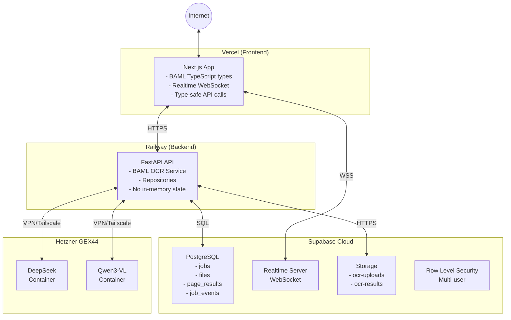
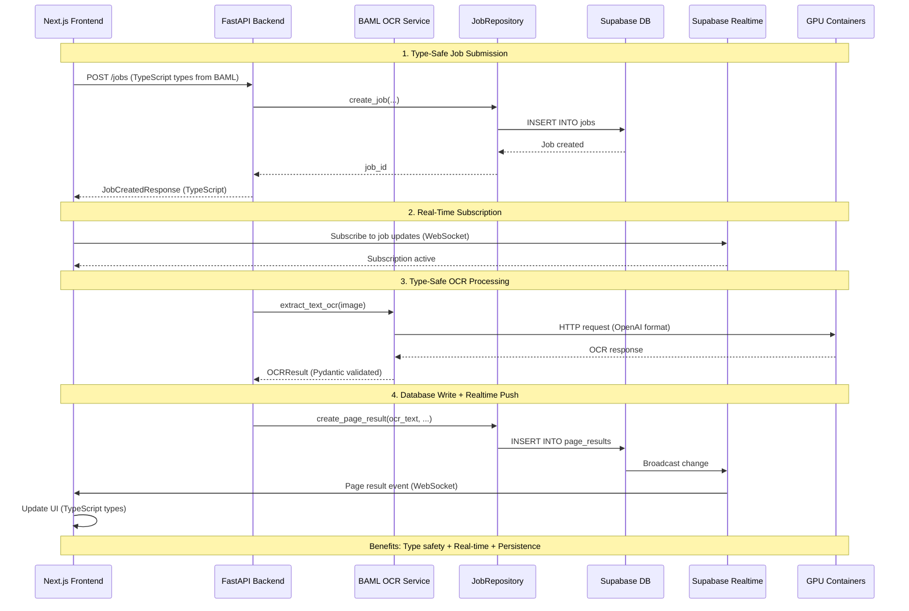

# OCR Service - Master Roadmap & Unified Specification

**Project:** OCR Service with DeepSeek-OCR, Qwen3-VL, BAML, and Supabase
**Date:** 2025-11-15
**Status:** Phase 3 (Partially Complete)
**Version:** 2.0

---

## Table of Contents

1. [Executive Summary](#executive-summary)
2. [Current State](#current-state)
3. [Target State](#target-state)
4. [Unified Phase Structure](#unified-phase-structure)
5. [Current Status Dashboard](#current-status-dashboard)
6. [Architecture Integration](#architecture-integration)
7. [Migration Strategy](#migration-strategy)
8. [Testing Strategy](#testing-strategy)
9. [Deployment Plan](#deployment-plan)
10. [Success Criteria](#success-criteria)

---

## Executive Summary

This document consolidates two parallel development tracks into a single unified roadmap:

1. **BAML Integration Track**: Type-safe LLM operations, prompt management, cross-language type generation
2. **Supabase Migration Track**: Database-backed architecture, real-time updates, multi-user support, horizontal scalability

### Key Achievement: Both Tracks Are Complementary

- **BAML** improves code quality, type safety, and LLM orchestration
- **Supabase** provides persistence, scalability, and production infrastructure
- **Together** they enable a production-ready, type-safe, scalable OCR service

### Project Goals

1. ✅ Type-safe OCR operations (Pydantic + TypeScript)
2. ✅ Centralized prompt management (BAML)
3. 🔄 Database-backed job state (Supabase PostgreSQL)
4. 🔄 Real-time updates without polling (Supabase Realtime)
5. ⏳ Jobs survive restarts (database persistence)
6. ⏳ Multi-user support (Row Level Security)
7. ⏳ Horizontal scalability (shared database state)
8. ⏳ Cloud deployment (Railway + Vercel + Hetzner)

---

## Current State

### What We Have (Phases 1-2 Complete)

**Infrastructure:**
- ✅ Local Supabase instance running
- ✅ BAML type system and service layer
- ✅ Database schema defined and applied
- ✅ Repository pattern implemented
- ✅ Dual-write to memory + database
- ✅ BAML integrated into OCR/merge pipeline
- ✅ Enhanced streaming metadata
- ✅ Frontend type sync from BAML

**Architecture:**
```
┌─────────────────────────────────────────────────────────┐
│  Frontend (Next.js)                                     │
│  - BAML-generated types (TypeScript)                    │
│  - SSE for real-time updates (polling)                  │
│  - Type-safe API calls                                  │
└─────────────────────────────────────────────────────────┘
                          ↓ HTTP + SSE
┌─────────────────────────────────────────────────────────┐
│  Backend (FastAPI)                                      │
│  - BAML OCR Service (type-safe)                         │
│  - JobManager (dual-write: memory + DB)                 │
│  - FileManager (dual-write: filesystem + Storage)       │
│  - Repository layer (Supabase)                          │
└─────────────────────────────────────────────────────────┘
      ↓ HTTP              ↓ SQL                 ↓ HTTP
┌─────────────┐   ┌─────────────────┐   ┌──────────────┐
│ DeepSeek    │   │ Supabase Local  │   │ Qwen3-VL     │
│ Container   │   │ - PostgreSQL    │   │ Container    │
│ GPU 0       │   │ - Storage       │   │ GPU 1        │
│ Port 8001   │   │ - Realtime      │   │ Port 8002    │
└─────────────┘   └─────────────────┘   └──────────────┘
```

### What We're Building (Phase 3 In Progress)

**Real-Time Infrastructure:**
- 🔄 Supabase Realtime subscriptions (WebSocket)
- 🔄 Dual-subscription monitoring (SSE + Realtime comparison)
- ⏳ Replace SSE with Realtime
- ⏳ Remove in-memory state
- ⏳ Database as single source of truth

---

## Target State

### Production Architecture (Phase 6)



### Key Capabilities (Target)

1. **Type Safety**
   - BAML types generate both Python (Pydantic) and TypeScript
   - Zero type drift between backend and frontend
   - Compile-time validation

2. **Persistence**
   - All jobs stored in PostgreSQL
   - Jobs survive backend restarts
   - Complete audit trail via job_events table

3. **Real-Time**
   - Instant updates via WebSocket (no polling)
   - Automatic reconnection on network issues
   - Progressive page rendering as OCR completes

4. **Scalability**
   - Multiple backend instances share database state
   - Horizontal scaling enabled
   - Container-based GPU workload distribution

5. **Multi-User**
   - User authentication (API keys initially)
   - Row Level Security (users only see their data)
   - Per-user storage quotas

---

## Unified Phase Structure

### Phase 1: Foundation ✅ COMPLETE

**Completed:** 2025-11-15
**Duration:** ~2 hours
**Status:** Production-ready

#### BAML Track (Phase 1)

**Deliverables:**
- ✅ BAML directory structure (`baml_src/`)
- ✅ Type definitions (`types.baml`)
  - OCRResult, PageResult, JobStatus, ProcessingOptions
  - BoundingBox, TextBlock, PageStructure
  - BatchResult, ContainerHealth
- ✅ Client configurations (`main.baml`)
  - DeepSeek OCR client
  - QWEN3-VL clients (8B/4B/2B)
  - Fallback strategies
  - Retry policies
- ✅ Function definitions (`ocr.baml`)
  - ExtractTextOCR(), MergeTexts(), MergeTextsStreaming()
  - ExtractVisualFormatting(), CheckContainerHealth()
- ✅ BAML OCR Service (`src/services/baml_ocr_service.py`)
  - Type-safe Pydantic models
  - Async operations
  - Streaming support
- ✅ TypeScript client generation (14 files)
- ✅ Test suite (`test_baml_integration.py`)

**Benefits Achieved:**
- Type consistency between Python and TypeScript
- Centralized prompt management
- OpenAI-compatible infrastructure
- Versioned prompts in `.baml` files

#### Supabase Track (Phase 1)

**Deliverables:**
- ✅ Supabase local instance running
- ✅ Database schema migration (`supabase/migrations/`)
  - `users` table (authentication)
  - `files` table (file metadata)
  - `jobs` table (OCR job state)
  - `page_results` table (per-page results)
  - `job_events` table (audit trail)
  - `batch_jobs` table (batch processing)
  - `directories` + `directory_files` (multi-file uploads)
- ✅ Storage buckets
  - `ocr-uploads` (uploaded files)
  - `ocr-results` (final outputs)
- ✅ Row Level Security policies
- ✅ Realtime publication configured
- ✅ Repository layer (`src/database/repositories/`)
  - BaseRepository (generic CRUD)
  - JobRepository (job lifecycle, events, pages)
  - FileRepository (file metadata, storage)
  - BatchRepository (batch operations)
- ✅ Supabase client wrapper (`src/database/supabase_client.py`)
- ✅ Environment configuration (`.env`, `config/settings.py`)

**Benefits Achieved:**
- Database schema ready for production
- Repository pattern enables testability
- Row Level Security ready for multi-user
- Event sourcing enables debugging/analytics

**Documentation:**
- [BAML_INTEGRATION_PHASE1.md](../archive/phases/BAML_INTEGRATION_PHASE1.md)
- [supabase-migration-spec.md](supabase-migration-spec.md) (Phase 1 section)

---

### Phase 2: Core Integration ✅ COMPLETE

**Completed:** 2025-11-15
**Duration:** ~4 hours
**Status:** Production-ready

#### BAML Track (Phase 2.1)

**Deliverables:**
- ✅ Application startup integration (`src/api/main.py`)
  - Initialize BAML service on startup
  - Lifecycle management (startup/shutdown)
  - Dependency injection
- ✅ JobManager integration (`src/api/services/job_manager.py`)
  - Accept `baml_ocr_service` parameter
  - Pass BAML service to pipeline
- ✅ Pipeline integration (`src/preprocessing/staged_pipeline.py`)
  - Use BAML service for OCR stage
  - Use BAML service for merge stage
  - Automatic fallback to direct container calls
- ✅ Test suite (`test_baml_phase2_integration.py`)

**Benefits Achieved:**
- Type-safe OCR operations with Pydantic validation
- Automatic fallback mechanism (resilience)
- Clean architecture with dependency injection
- No breaking changes to existing functionality

#### BAML Track (Phase 2.2)

**Deliverables:**
- ✅ Enhanced merge page metadata (`src/api/services/result_emitter.py`)
  - Added `processing_time` and `total_pages` optional parameters
  - Backward compatible (defaults to None)
- ✅ Pipeline call site update (`src/preprocessing/staged_pipeline.py`)
  - Pass page processing time and total pages
- ✅ Frontend type update (`web/lib/types.ts`)
  - Added optional fields to `MergePageCompleteEvent`
- ✅ Test script (`test_phase2_2_streaming.py`)

**Benefits Achieved:**
- Real-time progress tracking (`page_num / total_pages`)
- Accurate time estimation using actual page times
- Better UX: "Processing page 3 of 10..." display
- Live performance monitoring

#### Supabase Track (Phase 2)

**Deliverables:**
- ✅ Settings configuration (`config/settings.py`)
  - Supabase URL, keys, storage buckets
  - Load from `.env` file
- ✅ Supabase initialization (`src/api/main.py` lifespan)
  - Initialize Supabase client on startup
  - Create repositories
  - Inject into managers
- ✅ Dual-write pattern in JobManager
  - Write to memory (existing behavior)
  - Write to database (new behavior)
  - Log events to job_events table
  - Store page results in page_results table
  - Non-blocking with timeout (5 seconds)
  - Fallback to memory if DB write fails
- ✅ Dual-write pattern in FileManager
  - Upload to Supabase Storage
  - Store metadata in files table
- ✅ Dual-write pattern in BatchManager
  - Batch job metadata in batch_jobs table

**Benefits Achieved:**
- Jobs persisted to database (survive restarts)
- Complete audit trail in job_events table
- Progressive page results available immediately
- Files stored in cloud-ready storage
- Zero breaking changes (backward compatible)

**Integration Point:**
```python
# BAML generates type-safe OCRResult
ocr_result: OCRResult = await baml_ocr_service.extract_text_ocr(image)

# Result is stored in database via repository
await job_repository.create_page_result(
    job_id=job_id,
    page_num=page_num,
    ocr_text=ocr_result.text,
    ocr_processing_time=ocr_result.processing_time
)

# Frontend receives via SSE (Phase 2) or Realtime (Phase 3)
```

**Documentation:**
- [BAML_INTEGRATION_PHASE2.md](../archive/phases/BAML_INTEGRATION_PHASE2.md)
- [PHASE_2.2_IMPLEMENTATION_COMPLETE.md](../archive/phases/PHASE_2.2_IMPLEMENTATION_COMPLETE.md)
- [PHASE_2_COMPLETE.md](../archive/phases/PHASE_2_COMPLETE.md)
- [supabase-migration-spec.md](supabase-migration-spec.md) (Phase 2 section)

---

### Phase 3: Real-Time Infrastructure ✅ CODE COMPLETE (Testing Pending)

**Started:** 2025-11-15
**Code Complete:** 2025-11-15
**Status:** All code fixes implemented, integration testing requires full environment

#### BAML Track (Phase 2.3) ✅

**Deliverables:**
- ✅ BAML TypeScript generator fix (`web/baml_src/main.baml`)
  - Changed module_format from "esm" to "cjs"
  - Fixed Next.js import resolution issues
- ✅ Type re-exports (`web/lib/baml-wrapper.ts`)
  - Re-export all BAML types for frontend use
  - Single import source for components
- ✅ Frontend type synchronization (`web/lib/types.ts`)
  - Import BAML types from baml-wrapper
  - Remove duplicate type definitions
  - Maintain backward compatibility
- ✅ TypeScript strict null checks
  - Fixed MetricsTimeline.tsx null safety
  - Fixed useSystemMetrics.ts undefined handling
- ✅ Frontend build successful (zero errors)

**Benefits Achieved:**
- Zero type drift between backend and frontend
- Single source of truth for shared types (BAML)
- Automatic type synchronization via code generation
- TypeScript compile-time safety

#### Supabase Track (Phase 3) 🔄

**Completed:**
- ✅ Supabase client setup (`web/lib/supabase.ts`)
- ✅ Database type definitions (`web/types/database.ts`)
- ✅ Realtime job subscription hook (`web/hooks/useRealtimeJob.ts`)
- ✅ Realtime batch subscription hook (`web/hooks/useRealtimeBatch.ts`)
- ✅ Dual-subscription integration
  - `web/hooks/useOcrJob.ts` (SSE + Realtime comparison)
  - `web/hooks/useBatchJob.ts` (SSE + Realtime comparison)
  - Console logging for validation

**Completed (2025-11-15):**
- ✅ Fixed SystemMonitor component crash (null safety)
  - `web/components/SystemMonitor.tsx` - Added null checks for `current.gpus`
  - Added graceful fallback UI when GPU data unavailable
  - Fixed active_model null safety issues
  - TypeScript type checking passes (zero errors)
- ✅ Verified useSystemMetrics null handling (no changes needed)
- ✅ Created comprehensive test results documentation

**Pending (Requires Full Environment):**
- ⏳ Run integration tests (needs Supabase + Docker + API + Frontend running)
- ⏳ Validate latency comparison (SSE vs Realtime)
- ⏳ Document actual performance metrics
- ⏳ Create integration test script (`test_realtime_simple.sh`)

**Known Issues:**
- ✅ ~~SystemMonitor.tsx crashes when `current.gpus` is undefined~~ **FIXED 2025-11-15**
  - Location: `web/components/SystemMonitor.tsx:93, 273, 244, 248`
  - Fix: Added null safety checks and graceful fallbacks
  - Status: TypeScript compilation passes, ready for deployment

**Testing Status:**
- ✅ Code ready for testing (all null safety issues resolved)
- ⏳ Integration testing pending (requires full environment with Supabase, Docker, API, Frontend)
- ⏳ Test script needs to be created
- ✅ Manual testing procedure documented in PHASE_3_TEST_RESULTS.md

**Benefits (When Complete):**
- Instant real-time updates via WebSocket
- No polling overhead (reduced backend load)
- Automatic reconnection on network issues
- Lower latency than SSE
- Better mobile experience

**Documentation:**
- [PHASE_3_IMPLEMENTATION_PLAN.md](PHASE_3_IMPLEMENTATION_PLAN.md) - Detailed implementation plan for all 3 swim lanes
- [PHASE_3_TEST_RESULTS.md](PHASE_3_TEST_RESULTS.md) - Test results and environment limitations (2025-11-15)
- [PHASE_3.5_STATUS.md](../archive/phases/PHASE_3.5_STATUS.md)
- [PHASE_3.5_TESTING_READY.md](../archive/phases/PHASE_3.5_TESTING_READY.md)
- [supabase-migration-spec.md](supabase-migration-spec.md) (Phase 3 section)

---

### Phase 3.6: Merge Streaming Enhancement ⏳ PENDING

**Estimated Duration:** 2-3 hours
**Prerequisites:** Phase 3 complete (GPU metrics fix)
**Status:** Not started

#### Objectives

Add token-by-token streaming for merge stage to provide progressive visual feedback during page processing.

**Current Behavior:**
- Merge stage processes full page → waits 10-20s → emits complete result
- Frontend receives complete merged text all at once per page

**Target Behavior:**
- Merge stage streams text chunks as generated → progressive display
- Frontend shows text accumulating in real-time (typewriter effect)
- Better user experience during long merge operations

#### Deliverables

**Backend Changes:**

1. **Result Emitter Enhancement** (`src/api/services/result_emitter.py`)
   - Add `emit_merge_chunk(job_id, page_num, chunk, chunk_index)` method
   - Modify `emit_merge_page()` to add `streaming_complete` flag
   - New SSE event: `merge_chunk` for incremental text

2. **Pipeline Streaming** (`src/preprocessing/staged_pipeline.py`)
   - Replace `merge_texts()` call with `merge_texts_streaming()`
   - Implement async chunk collection and emission
   - Maintain OOM retry logic with streaming support
   - Accumulate chunks into final result

**Frontend Changes:**

3. **Merge Streaming Hook** (`web/hooks/useMergeStreaming.ts`)
   - New hook to handle `merge_chunk` events
   - Accumulate chunks per page
   - Provide real-time text state

4. **UI Integration** (`web/components/OcrJobView.tsx`)
   - Display streaming merge text with typewriter effect
   - Show blinking cursor during active streaming
   - Smooth transition to final result

#### Technical Details

**SSE Event Schema:**
```json
{
  "event": "merge_chunk",
  "data": {
    "page_num": 1,
    "chunk": "The ",
    "chunk_index": 0,
    "timestamp": "2025-11-15T10:30:45.123Z"
  }
}
```

**Data Flow:**
```
Pipeline → baml_ocr_service.merge_texts_streaming()
  → async for chunk in stream:
      → result_emitter.emit_merge_chunk()
      → SSE → Frontend accumulates chunks
  → result_emitter.emit_merge_page(streaming_complete=True)
```

**Infrastructure Already Exists:**
- BAML service has `merge_texts_streaming()` implemented (line 299-366)
- HTTP client manager supports streaming responses
- Frontend SSE infrastructure ready

#### Benefits

- **Better UX:** Users see progress instead of waiting for full page
- **Engagement:** Visual feedback reduces perceived wait time
- **Debugging:** Can see partial results if job fails mid-stream
- **Future-proof:** Enables real-time editing/corrections

#### Testing Requirements

- ✅ Chunks stream in correct order
- ✅ Final merged text matches accumulated chunks
- ✅ OOM retry still works with streaming
- ✅ Network disconnection handled gracefully
- ✅ Frontend accumulates chunks correctly per page
- ✅ Multiple pages stream independently

#### Rollback Plan

- Feature flag: `ENABLE_MERGE_STREAMING=false` in `.env`
- Conditional logic preserves non-streaming fallback
- Can disable without code changes

#### Success Criteria

- [ ] Merge chunks stream to frontend in real-time
- [ ] TypeScript types updated for `merge_chunk` event
- [ ] UI shows progressive text accumulation
- [ ] No performance degradation
- [ ] OOM protection still functional
- [ ] Documentation updated

**Documentation Reference:**
- Will create: `specs/PHASE_3.6_MERGE_STREAMING.md`

---

### Phase 3.7: Performance & Architecture Optimization ⏳ PENDING

**Estimated Duration:** 22-30 hours (3-4 days)
**Prerequisites:** Phase 3 complete and tested
**Status:** Not started
**Source:** [multi-page-parsing-architecture.md](multi-page-parsing-architecture.md)

#### Objectives

Address critical performance bottlenecks identified in the multi-page parsing architecture analysis before migrating to database-only operations in Phase 4.

**Key Performance Issues:**
1. **Sequential batch processing** - Documents processed one at a time (no parallelism)
2. **Individual page processing** - Pages processed sequentially (no batching)
3. **Excessive disk I/O** - 50-100+ writes per job (output, cache, checkpoint, DB)
4. **Per-page database transactions** - 100+ individual INSERTs per document

**Target Improvements:**
- 10x reduction in disk I/O operations
- 10x reduction in database transactions
- 2x batch processing throughput
- 3-5x per-document processing speedup
- **Overall: 6-10x faster end-to-end processing**

#### Why Phase 3.7 Before Phase 4?

Phase 4 will remove in-memory state and rely exclusively on database operations. Current performance bottlenecks will be **amplified** when reading from database instead of memory. Fixing these issues now:

- Makes Phase 4 migration smoother and faster
- Provides immediate user-facing improvements
- Easier to test with current dual-write architecture
- Prevents performance regression in Phase 4

#### Phase 3.7A: I/O Optimization & Quick Wins ⏳

**Duration:** 4-6 hours
**Priority:** ⭐⭐⭐⭐⭐ (Highest ROI)
**Risk:** Low (all additive changes)

**Deliverables:**

**1. Output Write Buffering** (Recommendation #3 from multi-page analysis)
- **File:** `src/preprocessing/staged_pipeline.py:708-731`
- **Change:** Buffer 10 pages before writing to disk
- **Current:** 100 pages = 100 disk writes
- **After:** 100 pages = 10 disk writes (10x reduction)
- **Effort:** 1 hour

**2. Database Write Batching** (Recommendation #4)
- **Files:**
  - `src/database/repositories/job_repository.py:173-217`
  - `src/preprocessing/staged_pipeline.py` (call sites)
- **Change:** Add `bulk_create_page_results()` method
- **Change:** Buffer page results, bulk insert every 10 pages
- **Current:** 100 pages = 100 individual INSERTs
- **After:** 100 pages = 10 bulk INSERTs (10x reduction)
- **Effort:** 1-2 hours

**3. Checkpoint Granularity** (Recommendation #5)
- **File:** `src/preprocessing/checkpoint_manager.py`
- **Change:** Save checkpoint every 5 pages OR every 30 seconds (whichever first)
- **Current:** 100 pages = 100 checkpoint writes
- **After:** 100 pages = 20 checkpoint writes (5x reduction)
- **Effort:** 1 hour

**4. Automated Cache Cleanup** (Recommendation #6)
- **Files:**
  - `src/api/main.py` (startup event)
  - `src/preprocessing/staged_pipeline.py` (finally block)
- **Change:** Add hourly background task to cleanup expired caches/uploads
- **Change:** Always cleanup cache in finally block (even on failure)
- **Impact:** Prevent disk space leaks from failed jobs
- **Effort:** 1-2 hours

**Testing Requirements:**
- [ ] Upload 50-page PDF, verify output file has ~5 buffered writes (not 50)
- [ ] Check database: ~5 bulk inserts instead of 50 individual inserts
- [ ] Verify checkpoint saved every 5 pages (~10 checkpoints for 50 pages)
- [ ] Trigger job failure, verify cache directory cleaned up
- [ ] Wait 1 hour, verify expired uploads deleted automatically

**Success Criteria:**
- ✅ 10x reduction in disk I/O operations
- ✅ 10x reduction in database transactions
- ✅ 5x reduction in checkpoint writes
- ✅ Zero orphaned cache directories after 24 hours
- ✅ No performance degradation
- ✅ All existing tests pass

#### Phase 3.7B: Batch Parallelization ⏳

**Duration:** 6-8 hours
**Priority:** ⭐⭐⭐⭐⭐ (Critical for multi-document workloads)
**Risk:** Medium (concurrency complexity)

**Objectives:**

Enable concurrent processing of multiple documents in batch jobs to leverage existing `max_concurrent_jobs = 2` configuration.

**Current Problem:**
- Batch documents processed **sequentially** (one at a time)
- 100-document batch with 2-min avg per doc = 200 minutes (3.3 hours)
- Existing concurrency config unused for batches

**Deliverables:**

**1. Concurrent Batch Processing** (Recommendation #1 from multi-page analysis)
- **File:** `src/api/services/batch_manager.py:191-335`
- **Change:** Replace sequential loop with `asyncio.gather()` + `Semaphore`
- **Change:** Process up to 2 documents concurrently (respects max_concurrent_jobs)
- **Current:** 100 docs × 2 min = 200 minutes
- **After:** 100 docs / 2 workers × 2 min = 100 minutes (2x speedup)
- **Effort:** 4 hours

**2. Concurrent Progress Tracking**
- **File:** `src/api/batch_routes.py:262-332`
- **Change:** Handle progress updates from multiple concurrent jobs
- **Change:** Aggregate overall batch progress correctly
- **Impact:** Accurate real-time progress during concurrent processing
- **Effort:** 2 hours

**3. Thread Safety Audit**
- **Files:** `src/api/services/job_manager.py`, `src/api/services/result_emitter.py`
- **Change:** Verify thread-safe access to shared state
- **Change:** Add locks if needed
- **Impact:** No race conditions or deadlocks
- **Effort:** 2 hours

**Testing Requirements:**
- [ ] Submit 10-document batch, verify 2 jobs run simultaneously
- [ ] Monitor system resources (CPU, memory) during concurrent processing
- [ ] Verify batch progress updates correctly with concurrent jobs
- [ ] Test error handling: 1 job fails, others continue
- [ ] Verify results written correctly for all concurrent jobs

**Success Criteria:**
- ✅ 2x batch processing throughput
- ✅ Batch progress accurately reflects concurrent jobs
- ✅ No race conditions or deadlocks
- ✅ Failed jobs don't block other jobs
- ✅ System resource usage within limits

#### Phase 3.7C: Page-Level Optimization ⏳

**Duration:** 12-16 hours
**Priority:** ⭐⭐⭐⭐⭐ (Critical for large documents)
**Risk:** Medium-High (container changes required)

**Objectives:**

Optimize per-page processing through either mini-batch inference or parallel page processing to achieve 3-5x speedup for large documents.

**Current Problem:**
- Pages processed **sequentially** (one at a time)
- 100-page document = 100-200 seconds (1.7-3.3 minutes)
- GPU containers underutilized

**Solution Options:**

**Option A: Mini-Batch Inference** (Preferred)
- Process 4-8 pages per container request
- Requires container API to accept multiple images
- Better GPU utilization (batch inference)
- 100 pages / 4 pages per batch = 25 requests
- Estimated time: 25 × 2.5 seconds = 62.5 seconds (3-4x speedup)

**Option B: Parallel Page Processing** (Alternative)
- Process multiple pages concurrently via ThreadPoolExecutor
- Each page = separate container request
- 4 parallel workers processing 100 pages
- Estimated time: 100 pages / 4 workers = 25 seconds per worker (4-8x speedup)
- Requires thread-safe container management

**Deliverables (Option A: Mini-Batch):**

**1. Container API Updates** (Recommendation #2 from multi-page analysis)
- **File:** `src/preprocessing/model_manager.py`
- **Change:** Add `infer_batch(model, images[])` method
- **Change:** Send multiple images to container in single request
- **Impact:** Enable batch processing
- **Effort:** 4 hours

**2. BAML Batch Support** (if needed)
- **File:** `baml_src/ocr.baml`
- **Change:** Add batch inference function (optional)
- **Change:** Update type definitions for batch results
- **Impact:** Type-safe batch operations
- **Effort:** 2 hours

**3. Pipeline Batch Processing**
- **File:** `src/preprocessing/staged_pipeline.py:332-706`
- **Change:** Replace sequential loop with batch loop (BATCH_SIZE = 4-8)
- **Change:** Handle batch results, emit progress per batch
- **Impact:** 3-4x speedup per document
- **Effort:** 4 hours

**4. Progress Tracking Updates**
- **Files:** Result emitters, progress callbacks
- **Change:** Emit progress after each batch (not each page)
- **Change:** Update frontend to handle batch progress
- **Impact:** Accurate progress for batched processing
- **Effort:** 2 hours

**Deliverables (Option B: Parallel Pages):**

**1. Thread-Safe Container Management**
- **File:** `src/preprocessing/model_manager.py`
- **Change:** Add connection pooling or request locks
- **Change:** Ensure concurrent requests handled safely
- **Impact:** No race conditions
- **Effort:** 4 hours

**2. Parallel Pipeline Processing**
- **File:** `src/preprocessing/staged_pipeline.py:332-706`
- **Change:** Replace sequential loop with ThreadPoolExecutor
- **Change:** Collect results as they complete
- **Impact:** 4-8x speedup per document
- **Effort:** 6 hours

**3. Progress Tracking for Parallel**
- **Files:** Result emitters, progress callbacks
- **Change:** Handle out-of-order page completion
- **Change:** Aggregate progress from parallel workers
- **Impact:** Accurate progress during parallel processing
- **Effort:** 2 hours

**Testing Requirements:**
- [ ] Verify containers accept multiple images (Option A) OR handle concurrent requests (Option B)
- [ ] Test batch sizes: 4, 8, 16 pages (Option A) OR worker counts: 2, 4, 8 (Option B)
- [ ] Measure actual speedup vs sequential baseline
- [ ] Verify OCR quality unchanged (compare results)
- [ ] Test with different page sizes/complexities
- [ ] Monitor GPU utilization and memory usage

**Success Criteria:**
- ✅ 3-5x speedup for large documents (50+ pages)
- ✅ OCR quality unchanged (same accuracy as sequential)
- ✅ Progress tracking accurate during batch/parallel processing
- ✅ No memory leaks or resource exhaustion
- ✅ GPU utilization optimized (>80% during processing)

**Decision Criteria: Option A vs B**

Choose **Option A (Mini-Batch)** if:
- GPU containers support batch inference
- Prefer better GPU utilization
- Lower risk of race conditions

Choose **Option B (Parallel Pages)** if:
- Containers don't support batch inference
- Containers can handle concurrent requests
- Have multiple GPU instances available

#### Benefits Achieved (Phase 3.7 Complete)

**Performance Improvements:**
- ✅ 6-10x faster end-to-end processing
- ✅ 10x reduction in disk I/O operations
- ✅ 10x reduction in database transactions
- ✅ 2x batch processing throughput
- ✅ 3-5x per-document speedup

**Operational Benefits:**
- ✅ Automated cleanup prevents disk space leaks
- ✅ Better resource utilization (CPU, GPU, disk)
- ✅ Smoother transition to Phase 4 (database-only)
- ✅ Improved user experience (faster results)

**Example Impact:**
- **Before:** 100-page document = 3-7 minutes, 100-doc batch = 16-33 hours
- **After:** 100-page document = 45-90 seconds, 100-doc batch = 8-16 hours

**Documentation:**
- [multi-page-parsing-architecture.md](multi-page-parsing-architecture.md) - Source analysis
- [PHASE_3.7_MERGE_PLAN.md](PHASE_3.7_MERGE_PLAN.md) - Integration plan

#### Deferred Items (Phase 5 or Optional)

The following low-priority recommendations from the multi-page analysis are deferred:

**Recommendation #7: Sub-Page Progress Granularity** (ROI: ⭐⭐)
- UX improvement: Show substeps ("extracting", "inferring", "merging")
- Effort: Medium (2-4 hours)
- Target: Phase 5 or Optional

**Recommendation #8: Adaptive Batching Strategy** (ROI: ⭐⭐)
- Dynamic strategy based on document sizes
- Effort: High (6-8 hours)
- Target: Phase 5 or Optional

**Recommendation #9: Result Compression** (ROI: ⭐⭐)
- Compress final output with gzip (60-80% storage reduction)
- Effort: Low (1-2 hours)
- Target: Phase 5 or Optional

---

### Phase 4: Infrastructure Migration ⏳ PENDING

**Estimated Duration:** 6-8 hours
**Prerequisites:** Phase 3 complete and tested, Phase 3.7 complete (Phase 3.6 optional)
**Status:** Not started

#### Objectives

1. **Remove SSE Infrastructure**
   - Replace SSE with Realtime exclusively
   - Comment out SSE endpoints (don't delete)
   - Stop emitting SSE events
   - Update frontend to use only Realtime

2. **Remove In-Memory State**
   - Delete in-memory dictionaries from managers
   - Read exclusively from database
   - Database becomes single source of truth
   - Jobs survive backend restarts

#### Deliverables

**Backend Changes:**
- Remove `self.jobs: Dict[str, Job] = {}` from JobManager
- Remove `self.job_lock` from JobManager
- Implement `_dict_to_job()` converter
- Replace `get_job()` to read from database
- Update all methods to read/write only database
- Add periodic cancellation check (poll database)
- Similar changes for FileManager and BatchManager

**Frontend Changes:**
- Remove SSE hooks (`useStreamingResults`, etc.)
- Update components to use Realtime only
- Remove polling (rely on Realtime updates)
- Keep initial fetch on mount

**Deprecated Files:**
- `src/api/services/result_emitter.py` (add deprecation warning)
- `src/api/services/progress_emitter.py` (add deprecation warning)
- SSE endpoints in `processing_routes.py` and `batch_routes.py` (comment out)

#### Testing Requirements

- ✅ Jobs survive backend restarts
- ✅ Job state intact after restart
- ✅ Multiple backend instances share state
- ✅ Cancellation works via database polling
- ✅ No performance degradation
- ✅ All features work identically

#### Challenges

**Performance:** Database reads slower than memory
- Mitigation: Connection pooling (Supabase)
- Future: Add caching layer (Redis) if needed

**Thread Safety:** No more threading.Lock needed
- PostgreSQL ACID guarantees consistency
- Rely on database transaction isolation

**Cancellation:** No in-memory flag
- Poll database periodically (every 10 iterations)
- Future: Use Postgres LISTEN/NOTIFY for instant cancellation

#### Rollback Plan

- Keep commented SSE code for 1-2 releases
- Document rollback procedure
- Git tag before Phase 4 deployment

**Documentation Reference:**
- [supabase-migration-spec.md](supabase-migration-spec.md) (Phase 4 & 5 sections)

---

### Phase 5: Production Readiness ⏳ PENDING

**Estimated Duration:** 1-2 days
**Prerequisites:** Phase 4 complete
**Status:** Not started

#### Objectives

1. **Performance Optimization**
   - Database query optimization
   - Index tuning
   - Connection pooling
   - Caching strategy (if needed)

2. **Monitoring & Observability**
   - Structured logging (JSON)
   - Error tracking (Sentry)
   - Performance metrics (Prometheus)
   - Database monitoring (Supabase dashboard)

3. **Error Handling**
   - Graceful degradation
   - Retry strategies
   - Circuit breakers
   - User-friendly error messages

4. **Security Hardening**
   - Rate limiting
   - Input validation
   - API key rotation
   - Secrets management

5. **Documentation**
   - API documentation (OpenAPI)
   - Deployment runbook
   - Troubleshooting guide
   - User documentation

#### Deliverables

- Performance benchmarks
- Monitoring dashboards
- Error tracking configured
- Security audit completed
- Documentation complete
- Load testing passed

#### Success Criteria

- p95 latency < 3 seconds (OCR per page)
- 99.9% uptime
- Zero data loss
- Comprehensive error logging
- Production runbook ready

---

### Phase 6: Cloud Deployment ⏳ PENDING

**Estimated Duration:** 1-2 days
**Prerequisites:** Phase 5 complete
**Status:** Not started

#### Deployment Architecture

**Recommended Stack:**
- **Frontend**: Vercel (Next.js)
- **Backend**: Railway (FastAPI)
- **Database**: Supabase Cloud (PostgreSQL + Realtime + Storage)
- **GPU**: Hetzner GEX44 (2x RTX 4000 Ada 20GB)
- **VPN**: Tailscale (Railway ↔ Hetzner)

**Cost Estimate:** ~$250-265/month
- Supabase Cloud: $25/month (Pro plan)
- Railway: $5-20/month (backend)
- Hetzner GEX44: €184/month (~$200)
- Vercel: $0 (hobby) or $20/month (Pro)

#### Deployment Steps

1. **Supabase Cloud**
   - Create project at supabase.com
   - Run migrations: `supabase db push`
   - Create storage buckets
   - Note: Project URL + keys

2. **Hetzner GPU Server**
   - Provision GEX44 server
   - SSH setup + security hardening
   - Install Docker + NVIDIA drivers
   - Start GPU containers
   - Install Tailscale

3. **Railway Backend**
   - Connect GitHub repo
   - Set environment variables
   - Deploy (auto-detect Python/uvicorn)
   - Install Tailscale
   - Test VPN connectivity to Hetzner

4. **Vercel Frontend**
   - Connect GitHub repo
   - Set environment variables
   - Deploy (auto-detect Next.js)
   - Test end-to-end

5. **DNS & HTTPS**
   - Point domain to Vercel (frontend)
   - Point API subdomain to Railway (backend)
   - Enable HTTPS (automatic on Vercel/Railway)
   - Setup Nginx reverse proxy on Hetzner (optional)

6. **Monitoring**
   - Railway logs
   - Supabase dashboard
   - Hetzner system monitoring
   - Uptime monitoring (UptimeRobot)

#### Environment Variables (Production)

**Backend (Railway):**
```bash
SUPABASE_URL=https://<project>.supabase.co
SUPABASE_SERVICE_KEY=<production-service-key>
DEEPSEEK_CONTAINER_URL=http://<tailscale-ip>:8001
QWEN_CONTAINER_URL=http://<tailscale-ip>:8002
```

**Frontend (Vercel):**
```bash
NEXT_PUBLIC_API_URL=https://api.yourdomain.com
NEXT_PUBLIC_SUPABASE_URL=https://<project>.supabase.co
NEXT_PUBLIC_SUPABASE_ANON_KEY=<production-anon-key>
```

**Documentation Reference:**
- [supabase-migration-spec.md](supabase-migration-spec.md) (Phase 6 section)

---

## Current Status Dashboard

### Completed Work ✅

| Component | Phase | Status | Date |
|-----------|-------|--------|------|
| BAML foundation | 1 | ✅ Complete | 2025-11-15 |
| BAML service layer | 1 | ✅ Complete | 2025-11-15 |
| Supabase local setup | 1 | ✅ Complete | 2025-11-15 |
| Database schema | 1 | ✅ Complete | 2025-11-15 |
| Repository layer | 1 | ✅ Complete | 2025-11-15 |
| BAML pipeline integration | 2 | ✅ Complete | 2025-11-15 |
| Dual-write pattern | 2 | ✅ Complete | 2025-11-15 |
| Enhanced streaming metadata | 2 | ✅ Complete | 2025-11-15 |
| Frontend type sync (BAML) | 3 | ✅ Complete | 2025-11-15 |
| Realtime subscription hooks | 3 | ✅ Complete | 2025-11-15 |
| Dual-subscription integration | 3 | ✅ Complete | 2025-11-15 |

### In Progress 🔄

| Component | Phase | Status | Blocker |
|-----------|-------|--------|---------|
| SystemMonitor null safety | 3 | 🐛 Bug | Crashes when GPU data undefined |
| Realtime testing | 3 | ⏳ Blocked | Waiting for SystemMonitor fix |

### Pending Work ⏳

| Component | Phase | Prerequisites | Estimated Time |
|-----------|-------|---------------|----------------|
| SystemMonitor bug fix | 3 | None | 30 min |
| Realtime validation | 3 | SystemMonitor fixed | 1 hour |
| Performance comparison | 3 | Realtime tested | 1 hour |
| Merge streaming backend | 3.6 | Phase 3 complete | 1 hour |
| Merge streaming frontend | 3.6 | Phase 3 complete | 1-2 hours |
| Output write buffering | 3.7A | Phase 3 complete | 1 hour |
| DB write batching | 3.7A | Phase 3 complete | 2 hours |
| Checkpoint granularity | 3.7A | Phase 3 complete | 1 hour |
| Cache cleanup automation | 3.7A | Phase 3 complete | 2 hours |
| Concurrent batch processing | 3.7B | Phase 3 complete | 4 hours |
| Concurrent progress tracking | 3.7B | Phase 3 complete | 2 hours |
| Thread safety audit | 3.7B | Phase 3 complete | 2 hours |
| Page-level optimization | 3.7C | Phase 3.7A complete | 12-16 hours |
| Remove SSE | 4 | Phase 3.7 complete | 3 hours |
| Remove in-memory state | 4 | Phase 3.7 complete | 4 hours |
| Performance optimization | 5 | Phase 4 complete | 1 day |
| Monitoring setup | 5 | Phase 4 complete | 1 day |
| Cloud deployment | 6 | Phase 5 complete | 2 days |

---

## Architecture Integration

### How BAML and Supabase Work Together



### Type Flow Diagram

```
┌──────────────────────────────────────────────────────┐
│  baml_src/types.baml                                 │
│  (Single Source of Truth)                            │
│                                                      │
│  type OCRResult {                                    │
│    text string                                       │
│    model_name string                                 │
│    processing_time float                             │
│  }                                                   │
└──────────────────────────────────────────────────────┘
                          │
        ┌─────────────────┴──────────────────┐
        ▼                                    ▼
┌──────────────────┐              ┌──────────────────┐
│ Python Backend   │              │ TypeScript       │
│ (Pydantic)       │              │ Frontend         │
│                  │              │                  │
│ class OCRResult: │              │ type OCRResult = │
│   text: str      │              │   text: string   │
│   model_name: str│              │   model_name: str│
│   ...            │              │   ...            │
└──────────────────┘              └──────────────────┘
        │                                    │
        ▼                                    ▼
┌──────────────────┐              ┌──────────────────┐
│ Supabase DB      │              │ React Components │
│                  │              │                  │
│ INSERT INTO      │◄─────────────┤ API calls with   │
│ page_results     │              │ type safety      │
│ (ocr_text, ...)  │              │                  │
└──────────────────┘              └──────────────────┘
        │
        ▼
┌──────────────────┐
│ Realtime Push    │
│                  │
│ WebSocket        │────────────►│ Frontend updates │
│ broadcast        │              │ with type safety │
└──────────────────┘              └──────────────────┘
```

**Key Integration Points:**

1. **BAML generates types** → Both Python (Pydantic) and TypeScript
2. **Backend processes OCR** → Type-safe OCRResult from BAML
3. **Backend writes to DB** → OCRResult stored via Repository
4. **Database broadcasts** → Realtime pushes to frontend
5. **Frontend receives** → Type-safe TypeScript from BAML

**Result:** Zero type drift, compile-time safety, real-time updates, full persistence

---

## Migration Strategy

### Incremental, Non-Breaking Approach

All phases follow the **additive changes only** principle:

1. **Phase 1**: Add BAML + Supabase infrastructure
   - ✅ No changes to existing code
   - ✅ Existing functionality untouched

2. **Phase 2**: Add dual-write pattern
   - ✅ Write to both memory AND database
   - ✅ Existing in-memory code continues working
   - ✅ Fallback if database unavailable

3. **Phase 3**: Add Realtime subscriptions
   - ✅ Both SSE AND Realtime active
   - ✅ Compare metrics
   - ✅ Validate reliability before switching

4. **Phase 4**: Remove old infrastructure
   - ⚠️ Breaking changes (SSE → Realtime)
   - ⚠️ Breaking changes (memory → database)
   - But: Rollback path documented

5. **Phase 5**: Optimize and harden
   - ✅ No breaking changes
   - ✅ Performance improvements
   - ✅ Better error handling

6. **Phase 6**: Deploy to cloud
   - ⚠️ Infrastructure change
   - But: Local development unchanged

### Rollback Strategy

**Phase 1-2**: No rollback needed (additive only)

**Phase 3**: Revert to SSE-only
```bash
git revert <phase-3-commits>
# SSE infrastructure still in place
```

**Phase 4**: Restore SSE and in-memory state
```bash
git revert <phase-4-commits>
# Uncomment SSE endpoints
# Restore in-memory dictionaries
```

**Phase 5-6**: Roll back to local deployment
```bash
# Update .env to use local Supabase
# Stop cloud services
# Restart local stack
```

---

## Testing Strategy

### Unit Tests

**Repository Tests:**
```bash
pytest tests/database/test_repositories.py -v
```

**BAML Service Tests:**
```bash
pytest tests/services/test_baml_ocr_service.py -v
```

### Integration Tests

**Phase 2.2 Streaming:**
```bash
# Start backend
uv run uvicorn src.api.main:app --reload

# Run test
uv run python test_phase2_2_streaming.py
```

**Phase 3 Realtime:**
```bash
# Start all services
supabase start
docker-compose up
uv run uvicorn src.api.main:app --reload
cd web && npm run dev

# Run test
bash test_realtime_simple.sh
```

### End-to-End Tests

**Full Workflow:**
1. Upload PDF via frontend
2. Submit job with custom prompts
3. Monitor real-time progress
4. Verify page results appear progressively
5. Download final markdown
6. Check database for complete audit trail

**Restart Persistence (Phase 4+):**
1. Submit long-running job
2. Restart backend mid-processing
3. Verify job resumes from checkpoint
4. Confirm no data loss

### Performance Tests

**Load Testing:**
```bash
# Multiple concurrent jobs
locust -f tests/load/locustfile.py --host=http://localhost:8000
```

**Latency Comparison:**
- SSE vs Realtime (Phase 3)
- Memory vs Database reads (Phase 4)
- Local vs Cloud deployment (Phase 6)

---

## Deployment Plan

### Local Development (Current)

**Services:**
- Supabase Local: `supabase start`
- GPU Containers: `docker-compose up`
- Backend: `uv run uvicorn src.api.main:app --reload`
- Frontend: `cd web && npm run dev`

**URLs:**
- Frontend: http://localhost:3000
- Backend API: http://localhost:8000
- Supabase Studio: http://localhost:54323
- DeepSeek: http://localhost:8001
- Qwen: http://localhost:8002

### Cloud Production (Phase 6)

**Services:**
- Frontend: Vercel (https://ocr.yourdomain.com)
- Backend: Railway (https://api.yourdomain.com)
- Database: Supabase Cloud (https://project.supabase.co)
- GPU: Hetzner GEX44 (VPN/Tailscale)

**Deployment Commands:**
```bash
# Deploy frontend
git push origin main  # Vercel auto-deploys

# Deploy backend
git push origin main  # Railway auto-deploys

# Migrate database
supabase link --project-ref <ref>
supabase db push

# GPU server
ssh hetzner-gpu
docker-compose pull
docker-compose up -d
```

---

## Success Criteria

### Phase 1 ✅
- [x] Supabase running locally
- [x] BAML types generate successfully
- [x] All tables created
- [x] Test user exists
- [x] Repositories passing unit tests

### Phase 2 ✅
- [x] Jobs written to database
- [x] Events logged to job_events
- [x] Files uploaded to Storage
- [x] BAML service integrated into pipeline
- [x] Streaming metadata enhanced
- [x] In-memory state still works

### Phase 3 🔄
- [x] Frontend receives Realtime updates
- [x] Dual-subscription logging works
- [ ] SystemMonitor bug fixed
- [ ] Integration tests pass
- [ ] Performance validated (Realtime faster than SSE)

### Phase 3.6 ⏳
- [ ] Backend merge streaming implemented
- [ ] Frontend merge streaming hook created
- [ ] UI shows progressive text accumulation
- [ ] OOM retry works with streaming
- [ ] Feature flag for rollback

### Phase 3.7 ⏳
- [ ] Output writes buffered (10 pages per write)
- [ ] Database writes batched (bulk inserts every 10 pages)
- [ ] Checkpoint saves reduced to 5-page intervals
- [ ] Cache cleanup task running hourly
- [ ] Batch jobs process 2 documents concurrently
- [ ] Page processing 3-5x faster for large documents
- [ ] All existing tests pass
- [ ] Performance benchmarks documented (6-10x overall improvement)

### Phase 4 ⏳
- [ ] SSE endpoints disabled
- [ ] Frontend uses only Realtime
- [ ] Jobs survive restarts
- [ ] No in-memory state
- [ ] Database is single source of truth

### Phase 5 ⏳
- [ ] p95 latency < 3s per page
- [ ] Monitoring dashboards operational
- [ ] Error tracking configured
- [ ] Security audit passed
- [ ] Documentation complete

### Phase 6 ⏳
- [ ] Production deployment live
- [ ] All services communicating
- [ ] 99.9% uptime
- [ ] Performance acceptable
- [ ] Cost within budget

---

## Next Steps (Immediate)

1. **Complete Phase 3 Testing** (2 hours)
   - Fix SystemMonitor bug (if needed)
   - Run integration tests
   - Validate Realtime subscriptions
   - Document latency comparison

2. **Implement Phase 3.6: Merge Streaming** (2-3 hours) ← **OPTIONAL QUICK WIN**
   - Add `emit_merge_chunk()` to result_emitter.py
   - Update pipeline to use `merge_texts_streaming()`
   - Create `useMergeStreaming.ts` hook
   - Update UI components for progressive display
   - **Impact:** Better UX, visual feedback during merge operations

3. **Implement Phase 3.7A: Quick Wins** (4-6 hours) ← **START HERE**
   - Output write buffering (10 pages per write)
   - Database write batching (bulk inserts)
   - Checkpoint granularity (every 5 pages)
   - Cache cleanup automation (hourly task)
   - **Impact:** 10x I/O reduction, minimal risk, highest ROI

4. **Decide on 3.7B vs 3.7C Priority** (based on workload)
   - **Many small documents** → Implement 3.7B first (batch parallelization)
   - **Few large documents** → Implement 3.7C first (page-level optimization)
   - **Recommended:** Implement both before Phase 4 for maximum performance

4. **Plan Phase 4 Migration** (1 hour)
   - Review SSE removal strategy
   - Plan in-memory state migration
   - Create rollback procedure
   - Note: Phase 4 will be faster with 3.7 optimizations in place

4. **Update Documentation** (ongoing)
   - Keep this master roadmap current
   - Document testing results
   - Update implementation status

---

## Revision History

| Version | Date | Author | Changes |
|---------|------|--------|---------|
| 1.0 | 2025-11-15 | Claude Code | Initial unified specification |
| 2.0 | 2025-11-15 | Claude Code | Merged BAML and Supabase tracks |
| 3.0 | 2025-11-16 | Claude Code | Added Phase 3.7: Performance & Architecture Optimization |

---

**END OF MASTER ROADMAP**
