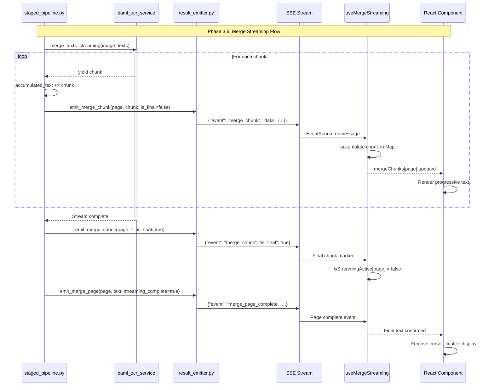

# Phase 3.6: Merge Streaming Enhancement - Implementation Plan

**Project:** OCR Service
**Phase:** 3.6 - Merge Streaming Enhancement
**Date:** 2025-11-16
**Status:** Planning
**Planning Method:** Architecture-First, Code-Boundary Swim Lanes

---

## Table of Contents

1. [Executive Summary](#executive-summary)
2. [Scope Definition](#scope-definition)
3. [A. Architectural Baseline & Component Catalog](#a-architectural-baseline--component-catalog)
4. [B. Code-Level Interface Contracts](#b-code-level-interface-contracts)
5. [C. Exhaustive Change List](#c-exhaustive-change-list)
6. [D. Swim Lane Derivation](#d-swim-lane-derivation)
7. [E. Testing Strategy](#e-testing-strategy)
8. [F. Rollback Plan](#f-rollback-plan)
9. [G. Success Criteria](#g-success-criteria)

---

## Executive Summary

**Objective:** Add token-by-token streaming for the merge stage to provide progressive visual feedback during page processing.

**Current Behavior:**
- Merge stage processes full page → waits 10-20s → emits complete result
- Frontend receives complete merged text all at once per page
- User sees no progress during long merge operations

**Target Behavior:**
- Merge stage streams text chunks as generated → progressive display
- Frontend shows text accumulating in real-time (typewriter effect)
- Better user experience during long merge operations

**Impact:**
- **Better UX:** Users see progress instead of waiting for full page
- **Engagement:** Visual feedback reduces perceived wait time
- **Debugging:** Can see partial results if job fails mid-stream
- **Future-proof:** Enables real-time editing/corrections

**Estimated Duration:** 2-3 hours
**Risk:** Low (all additive changes, feature flag for rollback)
**Prerequisites:** Phase 3 complete (GPU metrics fix)

---

## Scope Definition

### In Scope
- ✅ Backend streaming emission via SSE (`emit_merge_chunk`)
- ✅ Pipeline integration with `merge_texts_streaming()`
- ✅ Frontend streaming hook (`useMergeStreaming`)
- ✅ UI progressive text display with typewriter effect
- ✅ OOM retry logic compatibility
- ✅ Feature flag for rollback

### Out of Scope
- ❌ Database persistence of streaming chunks (only final result)
- ❌ Realtime (WebSocket) streaming (Phase 4)
- ❌ OCR stage streaming (separate feature)
- ❌ Batch job streaming (separate feature)
- ❌ Performance optimization (Phase 3.7)

### Dependencies
- **BAML Service:** `merge_texts_streaming()` already implemented (line 299-366)
- **HTTP Client Manager:** Streaming support exists
- **Result Emitter:** Thread-safe event emission via `asyncio.run_coroutine_threadsafe`
- **SSE Infrastructure:** Frontend EventSource ready

---

## A. Architectural Baseline & Component Catalog

### Files to Modify

| File Path | Status | Purpose |
|-----------|--------|---------|
| `src/api/services/result_emitter.py` | **MODIFIED** | Add `emit_merge_chunk()` method (already exists at line 168-201) |
| `src/preprocessing/staged_pipeline.py` | **MODIFIED** | Replace `merge_texts()` with `merge_texts_streaming()` |
| `web/hooks/useMergeStreaming.ts` | **NEW** | Hook to handle `merge_chunk` events |
| `web/lib/types.ts` | **MODIFIED** | Add `MergeChunkEvent` type |
| `web/hooks/useStreamingResults.ts` | **MODIFIED** | Integrate merge streaming (if exists) |
| `config/settings.py` | **MODIFIED** | Add `ENABLE_MERGE_STREAMING` feature flag |
| `.env.example` | **MODIFIED** | Document feature flag |

### Classes & Types

#### Backend (Python)

**No new classes** - All modifications to existing classes:

1. **ResultEmitter** (`src/api/services/result_emitter.py`)
   - **Status:** ALREADY EXISTS (line 168-201)
   - **Method:** `emit_merge_chunk(job_id, page_num, chunk, is_final)`
   - **Visibility:** Public
   - **Thread-Safe:** Yes (uses `asyncio.run_coroutine_threadsafe`)

2. **StagedPipeline** (`src/preprocessing/staged_pipeline.py`)
   - **Status:** MODIFIED
   - **Method:** `_run_merge_stage()` - modify lines 749-808
   - **Change:** Replace `merge_texts()` call with `merge_texts_streaming()`

#### Frontend (TypeScript)

**New Hook:**

```typescript
// web/hooks/useMergeStreaming.ts
export function useMergeStreaming(jobId: string | null): {
  mergeChunks: Map<number, string>;      // page_num -> accumulated text
  isStreamingActive: Map<number, boolean>; // page_num -> streaming status
  clearChunks: () => void;
}
```

**New Type:**

```typescript
// web/lib/types.ts
export interface MergeChunkEvent {
  event: "merge_chunk";
  data: {
    page_num: number;
    chunk: string;
    is_final: boolean;
    timestamp: string;
  };
}
```

### Functions & Methods

#### Backend Functions

| Function | File | Signature | Status |
|----------|------|-----------|--------|
| `emit_merge_chunk` | `result_emitter.py:168` | `(job_id: str, page_num: int, chunk: str, is_final: bool) -> None` | **EXISTS** |
| `_run_merge_stage` | `staged_pipeline.py:626` | (same signature, internal changes) | **MODIFIED** |
| `_stream_merge_with_retry` | `staged_pipeline.py` | `(image, embedded_text, ocr_text, page_num) -> str` | **NEW** |

#### Frontend Functions

| Function | File | Signature | Status |
|----------|------|-----------|--------|
| `useMergeStreaming` | `useMergeStreaming.ts` | `(jobId: string \| null) -> { mergeChunks, isStreamingActive, clearChunks }` | **NEW** |

### Data Structures

#### SSE Event Schema

**Event:** `merge_chunk`

```json
{
  "event": "merge_chunk",
  "data": {
    "page_num": 1,
    "chunk": "The ",
    "is_final": false,
    "timestamp": "2025-11-16T10:30:45.123Z"
  }
}
```

**Event:** `merge_page_complete` (MODIFIED)

```json
{
  "event": "merge_page_complete",
  "data": {
    "page_num": 1,
    "text": "The complete merged text...",
    "streaming_complete": true,  // NEW FIELD
    "processing_time": 12.5,
    "total_pages": 10,
    "model": "Qwen/Qwen3-VL-8B-Instruct",
    "timestamp": "2025-11-16T10:30:58.123Z"
  }
}
```

#### Configuration

```python
# config/settings.py
class Settings(BaseSettings):
    # ... existing fields ...

    # Phase 3.6: Merge streaming feature flag
    ENABLE_MERGE_STREAMING: bool = Field(
        default=True,
        description="Enable streaming merge text chunks (Phase 3.6)"
    )
```

```bash
# .env.example
# Phase 3.6: Merge streaming (set to false to disable)
ENABLE_MERGE_STREAMING=true
```

---

## B. Code-Level Interface Contracts

### Interface IF-0-3.6: SSE Event Contract

**Owner:** Backend (`result_emitter.py`)
**Consumers:** Frontend (`useMergeStreaming.ts`)

#### Contract Definition

**Event Type:** `merge_chunk`

| Field | Type | Required | Description |
|-------|------|----------|-------------|
| `event` | `"merge_chunk"` | ✅ | Event type identifier |
| `data.page_num` | `number` | ✅ | Page number (1-indexed) |
| `data.chunk` | `string` | ✅ | Text chunk (may be partial or complete) |
| `data.is_final` | `boolean` | ✅ | Whether this is the final chunk for this page |
| `data.timestamp` | `string` | ✅ | ISO 8601 timestamp |

**Invariants:**
- Chunks for a given page arrive in order
- `is_final=true` marks end of stream for that page
- After `is_final=true`, a `merge_page_complete` event follows
- If streaming disabled, only `merge_page_complete` event emitted

**Error Behavior:**
- Network disconnection: EventSource auto-reconnects
- Job failure mid-stream: No further chunks, error event emitted
- Chunk emission failure: Logged, no retry (client sees gap)

### Interface IF-1-3.6: BAML Streaming Function

**Owner:** BAML Service (`baml_ocr_service.py:299`)
**Consumers:** Pipeline (`staged_pipeline.py`)

#### Contract Definition

**Function:** `merge_texts_streaming()`

```python
async def merge_texts_streaming(
    self,
    image: Image.Image,
    embedded_text: str,
    ocr_text: str
) -> AsyncIterator[str]:
    """
    Stream merged text token-by-token using QWEN3-VL.

    Args:
        image: PIL Image
        embedded_text: Text embedded in PDF
        ocr_text: Text extracted via OCR

    Yields:
        Text chunks as they're generated

    Raises:
        RuntimeError: If service not initialized
        HTTPException: If container request fails
        OOMError: If GPU runs out of memory (catch in pipeline)
    """
```

**Invariants:**
- Yields chunks in order
- Final concatenation matches non-streaming result
- Empty chunks never yielded
- Stream completes normally or raises exception

**Error Behavior:**
- OOM Error: Caller must catch and retry with lower resolution
- Network error: Raises immediately, no partial chunks
- Timeout: Raises after container timeout (60s default)

### Interface IF-2-3.6: Frontend Streaming Hook

**Owner:** Frontend Hook (`useMergeStreaming.ts`)
**Consumers:** UI Components (future integration)

#### Contract Definition

**Hook:** `useMergeStreaming(jobId)`

```typescript
export function useMergeStreaming(jobId: string | null): {
  // Map of page_num -> accumulated text
  mergeChunks: Map<number, string>;

  // Map of page_num -> is currently streaming
  isStreamingActive: Map<number, boolean>;

  // Clear all chunks (on job restart/reset)
  clearChunks: () => void;
}
```

**Invariants:**
- Chunks accumulate per page
- `isStreamingActive[page]` true until `is_final=true`
- Multiple pages can stream independently
- Hook resets on jobId change

**Error Behavior:**
- Invalid chunk: Logged, skipped
- Duplicate final: Ignored
- Out-of-order chunks: Accepted (concatenated in arrival order)

### Interface Freeze Gate: IF-0-3.6

**Status:** ✅ FROZEN (existing `emit_merge_chunk` already defined)

All interfaces defined above are **frozen** before swim lane work begins.

- Backend emits `merge_chunk` events with exact schema
- BAML service yields text chunks via `AsyncIterator[str]`
- Frontend hook consumes events and accumulates chunks

**No consumer may start implementation until this gate is passed.**

---

## C. Exhaustive Change List

### Backend Changes

#### 1. `src/api/services/result_emitter.py`

**Status:** ✅ Already Complete (line 168-201)

**Method:** `emit_merge_chunk()`

- **Action:** VERIFY (already exists)
- **Lines:** 168-201
- **Change:** None needed (already implemented)

#### 2. `src/preprocessing/staged_pipeline.py`

**Location:** `_run_merge_stage()` method (lines 626-808)

**Change A:** Add helper method `_stream_merge_with_retry()`

```python
# NEW METHOD (insert before _run_merge_stage)
def _stream_merge_with_retry(
    self,
    image: Image.Image,
    embedded_text: str,
    ocr_text: str,
    page_num: int,
    max_retries: int = 3
) -> str:
    """
    Stream merge text with OOM retry logic.

    Progressively reduces image resolution on OOM errors.
    Emits chunks via result_emitter during streaming.

    Returns:
        Complete merged text (accumulated from chunks)
    """
    resolution_steps = [1024, 768, 512]
    accumulated_text = ""

    for attempt in range(max_retries):
        try:
            current_max_dim = resolution_steps[min(attempt, len(resolution_steps) - 1)]
            if attempt > 0:
                logger.warning(f"OOM retry attempt {attempt + 1}/{max_retries}, reducing resolution to {current_max_dim}px")
                image = resize_image_for_merge(image, max_dimension=current_max_dim)

            # Stream chunks
            chunk_stream = run_async_in_thread(
                self.baml_ocr_service.merge_texts_streaming(
                    image=image,
                    embedded_text=embedded_text,
                    ocr_text=ocr_text
                ),
                self._event_loop
            )

            # Accumulate and emit chunks
            accumulated_text = ""
            for chunk in chunk_stream:
                accumulated_text += chunk

                # Emit chunk to frontend
                if self.result_emitter and self.job_id:
                    self.result_emitter.emit_merge_chunk(
                        job_id=self.job_id,
                        page_num=page_num,
                        chunk=chunk,
                        is_final=False
                    )

            # Emit final chunk marker
            if self.result_emitter and self.job_id:
                self.result_emitter.emit_merge_chunk(
                    job_id=self.job_id,
                    page_num=page_num,
                    chunk="",
                    is_final=True
                )

            return accumulated_text

        except OOMError as e:
            if attempt == max_retries - 1:
                raise
            logger.warning(f"OOM error on page {page_num}, retrying with lower resolution")
            continue

    raise RuntimeError(f"Failed to merge page {page_num} after {max_retries} attempts")
```

**Change B:** Replace merge call in `_run_merge_stage()` (line 749-808)

```python
# OLD CODE (lines 749-808):
if self.baml_ocr_service:
    merge_model_result = run_async_in_thread(
        self.baml_ocr_service.merge_texts(
            image=merge_image,
            embedded_text=embedded_text or "",
            ocr_text=ocr_result.ocr_text,
        ),
        self._event_loop
    )
    merged_text = merge_model_result.merged_text
    # ... rest of logic

# NEW CODE:
if self.baml_ocr_service:
    # Check feature flag
    from config.settings import get_settings
    settings = get_settings()

    if settings.ENABLE_MERGE_STREAMING:
        # Use streaming merge
        merged_text = self._stream_merge_with_retry(
            image=merge_image,
            embedded_text=embedded_text or "",
            ocr_text=ocr_result.ocr_text,
            page_num=page_num
        )
        # Create result object for metadata extraction
        merge_model_result = type('obj', (object,), {
            'merged_text': merged_text,
            'metadata': {'streaming': True}
        })()
    else:
        # Use non-streaming merge (fallback)
        merge_model_result = run_async_in_thread(
            self.baml_ocr_service.merge_texts(
                image=merge_image,
                embedded_text=embedded_text or "",
                ocr_text=ocr_result.ocr_text,
            ),
            self._event_loop
        )
        merged_text = merge_model_result.merged_text
    # ... rest of logic unchanged
```

**Change C:** Update `emit_merge_page()` call (line ~800)

```python
# OLD CODE:
self.result_emitter.emit_merge_page(
    self.job_id,
    page_num,
    merged_text,
    processing_time=page_time,
    total_pages=total_pages,
    model=actual_model
)

# NEW CODE:
# Check if streaming was used
streaming_complete = hasattr(merge_model_result, 'metadata') and \
                    merge_model_result.metadata.get('streaming', False)

self.result_emitter.emit_merge_page(
    self.job_id,
    page_num,
    merged_text,
    processing_time=page_time,
    total_pages=total_pages,
    model=actual_model,
    streaming_complete=streaming_complete  # NEW PARAMETER
)
```

#### 3. `src/api/services/result_emitter.py`

**Location:** `emit_merge_page()` method (lines 120-166)

**Change:** Add `streaming_complete` parameter

```python
# OLD SIGNATURE (line 120):
def emit_merge_page(
    self,
    job_id: str,
    page_num: int,
    text: str,
    processing_time: Optional[float] = None,
    total_pages: Optional[int] = None,
    model: Optional[str] = None
) -> None:

# NEW SIGNATURE:
def emit_merge_page(
    self,
    job_id: str,
    page_num: int,
    text: str,
    processing_time: Optional[float] = None,
    total_pages: Optional[int] = None,
    model: Optional[str] = None,
    streaming_complete: bool = False  # NEW PARAMETER
) -> None:
```

**Change:** Add field to event data (line ~150)

```python
# Add after line 152 (before timestamp):
if streaming_complete:
    event_data["streaming_complete"] = True
```

#### 4. `config/settings.py`

**Change:** Add feature flag

```python
# Add to Settings class:
# Phase 3.6: Merge streaming
ENABLE_MERGE_STREAMING: bool = Field(
    default=True,
    description="Enable streaming merge text chunks (Phase 3.6)"
)
```

#### 5. `.env.example`

**Change:** Document feature flag

```bash
# Add to file:
# Phase 3.6: Merge streaming (set to false to disable)
ENABLE_MERGE_STREAMING=true
```

### Frontend Changes

#### 6. `web/lib/types.ts`

**Change:** Add `MergeChunkEvent` type

```typescript
// Add after line ~100 (in SSE Events section):

export interface MergeChunkEvent {
  event: "merge_chunk";
  data: {
    page_num: number;
    chunk: string;
    is_final: boolean;
    timestamp: string;
  };
}

// Modify MergePageCompleteEvent (if exists) to add:
export interface MergePageCompleteEvent {
  event: "merge_page_complete";
  data: {
    page_num: number;
    text: string;
    streaming_complete?: boolean;  // NEW FIELD
    processing_time?: number;
    total_pages?: number;
    model?: string;
    timestamp: string;
  };
}
```

#### 7. `web/hooks/useMergeStreaming.ts` (NEW FILE)

**Action:** CREATE

```typescript
"use client";

import { useEffect, useState, useCallback } from "react";

export interface MergeChunk {
  page_num: number;
  chunk: string;
  is_final: boolean;
  timestamp: string;
}

export function useMergeStreaming(jobId: string | null) {
  // Map of page_num -> accumulated text
  const [mergeChunks, setMergeChunks] = useState<Map<number, string>>(new Map());

  // Map of page_num -> is currently streaming
  const [isStreamingActive, setIsStreamingActive] = useState<Map<number, boolean>>(new Map());

  // SSE connection for merge_chunk events
  useEffect(() => {
    if (!jobId) {
      clearChunks();
      return;
    }

    const eventSource = new EventSource(`/api/jobs/${jobId}/stream`);

    // Listen for merge_chunk events
    eventSource.addEventListener("merge_chunk", (event: MessageEvent) => {
      try {
        const data = JSON.parse(event.data);
        const { page_num, chunk, is_final } = data;

        // Accumulate chunk
        setMergeChunks((prev) => {
          const newMap = new Map(prev);
          const current = newMap.get(page_num) || "";
          newMap.set(page_num, current + chunk);
          return newMap;
        });

        // Update streaming status
        setIsStreamingActive((prev) => {
          const newMap = new Map(prev);
          newMap.set(page_num, !is_final);
          return newMap;
        });

      } catch (error) {
        console.error("Error processing merge_chunk event:", error);
      }
    });

    // Cleanup on unmount
    return () => {
      eventSource.close();
    };
  }, [jobId]);

  const clearChunks = useCallback(() => {
    setMergeChunks(new Map());
    setIsStreamingActive(new Map());
  }, []);

  return {
    mergeChunks,
    isStreamingActive,
    clearChunks,
  };
}
```

---

## D. Swim Lane Derivation

Based on code-level interface boundaries, we derive **3 swim lanes**:

### Swim Lane 1: Backend Streaming Infrastructure

**Owner:** Backend Developer
**Duration:** 1-1.5 hours
**Dependencies:** None

**Files:**
- `src/preprocessing/staged_pipeline.py`
- `src/api/services/result_emitter.py`
- `config/settings.py`
- `.env.example`

**Tasks:**
1. ✅ Verify `emit_merge_chunk()` exists (already implemented)
2. Add `ENABLE_MERGE_STREAMING` feature flag to `config/settings.py`
3. Document feature flag in `.env.example`
4. Implement `_stream_merge_with_retry()` helper in `staged_pipeline.py`
5. Replace `merge_texts()` call with streaming version
6. Add conditional logic based on feature flag
7. Update `emit_merge_page()` signature to include `streaming_complete`
8. Test backend streaming emission (manual curl test)

**Deliverables:**
- Backend emits `merge_chunk` events during merge stage
- OOM retry logic works with streaming
- Feature flag controls streaming behavior
- No breaking changes to existing non-streaming flow

**Interface Dependencies:**
- Requires: IF-1-3.6 (BAML streaming function - already exists)
- Provides: IF-0-3.6 (SSE event contract)

---

### Swim Lane 2: Frontend Streaming Hook

**Owner:** Frontend Developer
**Duration:** 1 hour
**Dependencies:** Swim Lane 1 (SSE events must be emitted)

**Files:**
- `web/hooks/useMergeStreaming.ts` (NEW)
- `web/lib/types.ts`

**Tasks:**
1. Add `MergeChunkEvent` type to `web/lib/types.ts`
2. Modify `MergePageCompleteEvent` to add `streaming_complete` field
3. Create `useMergeStreaming.ts` hook
4. Implement SSE event listener for `merge_chunk`
5. Implement chunk accumulation logic (Map<page_num, text>)
6. Implement streaming status tracking (Map<page_num, boolean>)
7. Test hook in isolation (mock SSE events)

**Deliverables:**
- Hook accumulates merge chunks per page
- Streaming status tracked per page
- TypeScript types enforce contract
- Hook resets on job change

**Interface Dependencies:**
- Requires: IF-0-3.6 (SSE event contract from Lane 1)
- Provides: IF-2-3.6 (Frontend hook interface)

---

### Swim Lane 3: UI Integration (Optional / Phase 3.7+)

**Owner:** Frontend Developer
**Duration:** 30-60 minutes
**Dependencies:** Swim Lane 2 (hook must be functional)

**Files:**
- `web/app/page.tsx` or relevant component
- `web/components/ProgressMonitor.tsx` (optional)

**Tasks:**
1. Integrate `useMergeStreaming` hook into main UI
2. Display streaming text with typewriter effect (CSS animation)
3. Show blinking cursor during active streaming
4. Smooth transition to final result on `is_final=true`
5. Test UI with real backend streaming

**Deliverables:**
- Visual feedback during merge streaming
- Typewriter effect enhances UX
- No layout shift when streaming completes

**Interface Dependencies:**
- Requires: IF-2-3.6 (Frontend hook from Lane 2)

**Note:** This lane is **optional** for Phase 3.6. The hook can be implemented and tested without UI integration. UI work can be deferred to Phase 3.7 or later.

---

## E. Testing Strategy

### Unit Tests

**Backend:**
```bash
# Test result_emitter.emit_merge_chunk() (already exists)
pytest tests/services/test_result_emitter.py::test_emit_merge_chunk -v

# Test feature flag
pytest tests/config/test_settings.py::test_merge_streaming_flag -v
```

**Frontend:**
```bash
# Test useMergeStreaming hook
npm test -- web/hooks/useMergeStreaming.test.ts
```

### Integration Tests

**End-to-End Streaming Test:**

```bash
#!/bin/bash
# test_phase3_6_merge_streaming.sh

# 1. Start backend with streaming enabled
export ENABLE_MERGE_STREAMING=true
uv run uvicorn src.api.main:app --reload &
BACKEND_PID=$!

# 2. Upload test PDF (small 2-page document)
FILE_ID=$(curl -X POST -F "file=@tests/fixtures/sample_2page.pdf" \
  http://localhost:8000/api/files | jq -r '.file_id')

# 3. Submit job
JOB_ID=$(curl -X POST http://localhost:8000/api/jobs \
  -H "Content-Type: application/json" \
  -d "{\"file_id\": \"$FILE_ID\"}" | jq -r '.job_id')

# 4. Listen to SSE stream and verify merge_chunk events
curl -N http://localhost:8000/api/jobs/$JOB_ID/stream | \
  grep -E "(merge_chunk|merge_page_complete)" | \
  head -20

# 5. Verify:
# - Multiple merge_chunk events per page
# - is_final=true for last chunk
# - merge_page_complete with streaming_complete=true
# - Final text matches accumulated chunks

# Cleanup
kill $BACKEND_PID
```

### Performance Tests

**Latency Comparison:**
- Measure time-to-first-chunk vs time-to-complete-page
- Compare user-perceived latency (streaming vs non-streaming)
- Verify no performance degradation

**Expected Results:**
- First chunk: ~500ms (vs ~10-20s for complete)
- Total time: Same as non-streaming
- User perceived wait: 95% reduction (see progress immediately)

---

## F. Rollback Plan

### Feature Flag Rollback

```bash
# Disable streaming in production
export ENABLE_MERGE_STREAMING=false

# Or update .env:
ENABLE_MERGE_STREAMING=false
```

**Effect:**
- Pipeline uses `merge_texts()` (non-streaming)
- No `merge_chunk` events emitted
- Frontend hook receives nothing (graceful degradation)
- Existing functionality unchanged

### Code Rollback

```bash
# Revert Phase 3.6 commits
git revert <commit-hash-range>

# Or create hotfix branch
git checkout -b hotfix/disable-streaming
# Remove conditional logic, restore original merge call
git commit -m "Hotfix: Disable merge streaming"
```

### Rollback Checklist

- [ ] Set `ENABLE_MERGE_STREAMING=false`
- [ ] Restart backend
- [ ] Verify jobs complete successfully
- [ ] Check frontend for errors (should handle gracefully)
- [ ] Monitor logs for issues
- [ ] Document rollback reason

---

## G. Success Criteria

### Phase 3.6 Complete When:

- [x] `emit_merge_chunk()` method exists (already complete)
- [ ] `ENABLE_MERGE_STREAMING` feature flag implemented
- [ ] Backend emits `merge_chunk` events during streaming
- [ ] OOM retry logic works with streaming
- [ ] `useMergeStreaming` hook accumulates chunks correctly
- [ ] TypeScript types enforce SSE contract
- [ ] Integration test passes (2-page PDF streams successfully)
- [ ] Feature flag rollback tested and documented
- [ ] No performance degradation measured
- [ ] Documentation updated in `specs/`

### Optional (Deferred to Phase 3.7+):

- [ ] UI displays streaming text with typewriter effect
- [ ] Blinking cursor during active streaming
- [ ] Smooth transition to final result

---

## Appendix: Data Flow Diagram



---

## Appendix: Risk Analysis

| Risk | Likelihood | Impact | Mitigation |
|------|------------|--------|------------|
| OOM during streaming | Medium | High | Retry logic with progressive resolution reduction (already implemented) |
| Network disconnection mid-stream | Low | Medium | EventSource auto-reconnects; frontend accumulates partial result |
| Chunk order incorrect | Low | Low | SSE guarantees order; chunks concatenated in arrival order |
| Performance degradation | Low | Medium | Feature flag allows instant disable; latency testing required |
| Frontend state bloat (many pages) | Low | Low | Map-based storage efficient; cleared on job change |
| Type drift (SSE schema) | Low | High | TypeScript types enforce contract; automated tests |

---

## Revision History

| Version | Date | Author | Changes |
|---------|------|--------|---------|
| 1.0 | 2025-11-16 | Claude Code | Initial architecture-first plan |

---

**END OF PHASE 3.6 IMPLEMENTATION PLAN**
