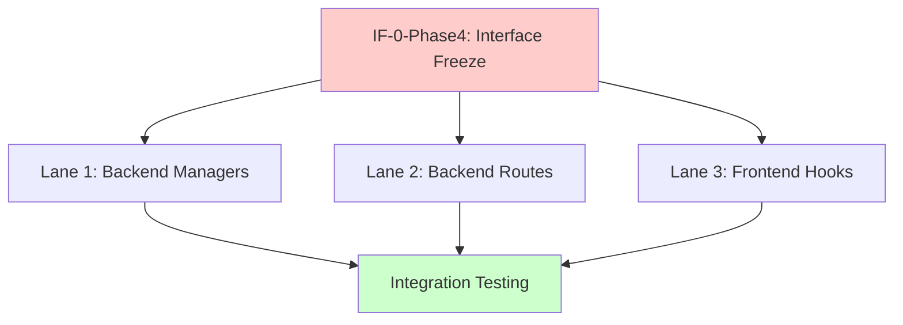

# Phase 4 Implementation Plan: Infrastructure Migration
**Architecture-First, Code-Boundary Swim Lanes**

**Date:** 2025-11-16
**Phase:** Phase 4 - Infrastructure Migration
**Prerequisites:** Phase 3 complete and tested, Phase 3.7 complete (Phase 3.6 optional)
**Estimated Duration:** 6-8 hours
**Status:** Planning

---

## Table of Contents

1. [Phase Scope](#phase-scope)
2. [Architectural Baseline & Component Catalog](#architectural-baseline--component-catalog)
3. [Code-Level Interface Contracts](#code-level-interface-contracts)
4. [Exhaustive Change List](#exhaustive-change-list)
5. [Swim Lane Architecture](#swim-lane-architecture)
6. [Implementation Order](#implementation-order)
7. [Testing Strategy](#testing-strategy)
8. [Rollback Plan](#rollback-plan)

---

## Phase Scope

### Objectives

Phase 4 migrates the OCR service from a dual-write architecture (in-memory + database) to a **database-only architecture** where the database becomes the single source of truth.

**Primary Goals:**
1. **Remove SSE Infrastructure** - Replace Server-Sent Events with Supabase Realtime exclusively
2. **Remove In-Memory State** - Delete in-memory dictionaries from managers, read exclusively from database
3. **Enable Persistence** - Jobs survive backend restarts
4. **Enable Horizontal Scaling** - Multiple backend instances share database state

**Out of Scope:**
- Performance optimization (Phase 5)
- Monitoring infrastructure (Phase 5)
- Cloud deployment (Phase 6)
- New features

---

## Architectural Baseline & Component Catalog

### Current Architecture (Phase 3)

```
┌─────────────────────────────────────────────────┐
│  Frontend (Next.js)                             │
│  - SSE hooks + Realtime hooks (dual)            │
│  - Polling for job status                       │
└─────────────────────────────────────────────────┘
          ↓ HTTP + SSE + WebSocket
┌─────────────────────────────────────────────────┐
│  Backend (FastAPI)                              │
│  - JobManager (in-memory dict + DB)             │
│  - FileManager (in-memory dict + DB)            │
│  - BatchManager (in-memory dict + DB)           │
│  - ResultEmitter (SSE)                          │
│  - ProgressEmitter (SSE)                        │
└─────────────────────────────────────────────────┘
          ↓ SQL                    ↓ SSE
┌────────────────────┐    ┌──────────────────┐
│ Supabase DB        │    │ SSE Clients      │
│ (Dual-write)       │    │ (Active)         │
└────────────────────┘    └──────────────────┘
```

### Target Architecture (Phase 4)

```
┌─────────────────────────────────────────────────┐
│  Frontend (Next.js)                             │
│  - Realtime hooks ONLY                          │
│  - No polling, no SSE                           │
└─────────────────────────────────────────────────┘
          ↓ HTTP + WebSocket
┌─────────────────────────────────────────────────┐
│  Backend (FastAPI)                              │
│  - JobManager (DB-only, no in-memory)           │
│  - FileManager (DB-only, no in-memory)          │
│  - BatchManager (DB-only, no in-memory)         │
│  - ResultEmitter (DEPRECATED)                   │
│  - ProgressEmitter (DEPRECATED)                 │
└─────────────────────────────────────────────────┘
          ↓ SQL                    ↓ WebSocket
┌────────────────────┐    ┌──────────────────┐
│ Supabase DB        │───▶│ Realtime Server  │
│ (Single source)    │    │ (Broadcasts)     │
└────────────────────┘    └──────────────────┘
```

### Post-Implementation Component Catalog

#### 1. Files Modified

**Backend:**
- `src/api/services/job_manager.py` - **MODIFIED** (remove in-memory state)
- `src/api/services/file_manager.py` - **MODIFIED** (remove in-memory state)
- `src/api/services/batch_manager.py` - **MODIFIED** (remove in-memory state)
- `src/api/services/result_emitter.py` - **DEPRECATED** (add deprecation notice)
- `src/api/services/progress_emitter.py` - **DEPRECATED** (add deprecation notice)
- `src/api/processing_routes.py` - **MODIFIED** (comment out SSE endpoint)
- `src/api/batch_routes.py` - **MODIFIED** (comment out SSE endpoints)
- `src/api/main.py` - **MODIFIED** (update manager initialization)

**Frontend:**
- `web/hooks/useOcrJob.ts` - **MODIFIED** (remove SSE, use Realtime only)
- `web/hooks/useBatchJob.ts` - **MODIFIED** (remove SSE, use Realtime only)
- `web/hooks/useStreamingResults.ts` - **DEPRECATED** (add deprecation notice)
- `web/components/OcrJobView.tsx` - **MODIFIED** (use Realtime only)
- `web/components/BatchJobView.tsx` - **MODIFIED** (use Realtime only)

#### 2. Classes / Types Modified

**Backend Classes:**

| Class | File | Change Type | Visibility |
|-------|------|-------------|------------|
| `JobManager` | `src/api/services/job_manager.py` | **MODIFIED** | Public |
| `FileManager` | `src/api/services/file_manager.py` | **MODIFIED** | Public |
| `BatchManager` | `src/api/services/batch_manager.py` | **MODIFIED** | Public |
| `ResultEmitter` | `src/api/services/result_emitter.py` | **DEPRECATED** | Public |
| `ProgressEmitter` | `src/api/services/progress_emitter.py` | **DEPRECATED** | Public |

**Frontend Hooks:**

| Hook | File | Change Type |
|------|------|-------------|
| `useOcrJob` | `web/hooks/useOcrJob.ts` | **MODIFIED** |
| `useBatchJob` | `web/hooks/useBatchJob.ts` | **MODIFIED** |
| `useStreamingResults` | `web/hooks/useStreamingResults.ts` | **DEPRECATED** |
| `useRealtimeJob` | `web/hooks/useRealtimeJob.ts` | **NO CHANGE** |
| `useRealtimeBatch` | `web/hooks/useRealtimeBatch.ts` | **NO CHANGE** |

#### 3. Functions / Methods Modified

**JobManager Methods:**

| Method | Signature | Change Type | Return Type |
|--------|-----------|-------------|-------------|
| `__init__()` | `(processing_directory, output_directory, max_concurrent_jobs, result_emitter, event_loop, job_repository, container_orchestrator)` | **MODIFIED** | `None` |
| `create_job()` | `async (file_id, filename, model, prompt_type, custom_prompts, processing_options, output_format, estimated_pages)` | **MODIFIED** | `Job` |
| `get_job()` | `async (job_id)` | **MODIFIED** (async, DB read) | `Job` |
| `_dict_to_job()` | `(db_record: Dict[str, Any])` | **NEW** | `Job` |
| `_check_cancellation_from_db()` | `async (job_id)` | **NEW** | `bool` |
| `cancel_job()` | `async (job_id)` | **MODIFIED** (async, DB write) | `bool` |

**FileManager Methods:**

| Method | Signature | Change Type | Return Type |
|--------|-----------|-------------|-------------|
| `__init__()` | `(temp_directory, expiry_hours, file_repository, supabase_client, dev_user_id)` | **NO CHANGE** | `None` |
| `get_directory_files()` | `async (directory_id)` | **MODIFIED** (read from DB) | `List[Dict]` |

**BatchManager Methods:**

| Method | Signature | Change Type | Return Type |
|--------|-----------|-------------|-------------|
| `__init__()` | `(processing_directory, output_directory, max_concurrent_batches, batch_repository, event_loop)` | **MODIFIED** | `None` |
| `get_batch_job()` | `async (batch_job_id)` | **MODIFIED** (async, DB read) | `BatchJob` |

#### 4. Data Structures

**Job Dataclass (Existing):**
```python
@dataclass
class Job:
    job_id: str
    file_id: str
    filename: str
    model: str
    prompt_type: str
    custom_prompts: Optional[Dict[str, str]]
    processing_options: Dict[str, Any]
    output_format: str
    status: JobStatus
    created_at: datetime
    started_at: Optional[datetime] = None
    completed_at: Optional[datetime] = None
    total_pages: Optional[int] = None
    pages_completed: int = 0
    current_stage: Optional[str] = None
    progress_pct: float = 0.0
    result_path: Optional[Path] = None
    error: Optional[str] = None
    cancel_requested: bool = False  # ← Will be read from DB
    parent_batch_id: Optional[str] = None
```

**Database Schema (Existing, No Changes):**
- `jobs` table - primary source of truth
- `files` table - primary source of truth
- `batch_jobs` table - primary source of truth
- `page_results` table - stores per-page results
- `job_events` table - audit trail

---

## Code-Level Interface Contracts

### Interface Freeze Gates

All interfaces must be frozen **before** swim lanes begin work. Consumers cannot start until interfaces are stable.

**Interface Freeze Gate:** `IF-0-Phase4` - Database-only interface contracts

---

### IF-1: JobManager Database Interface

**Owning Component:** JobManager
**Consumers:** ProcessingRoutes, PipelineProcessor
**Status:** FROZEN ✅

**Public Methods (Changed to async, DB-backed):**

```python
class JobManager:
    """Manage job lifecycle - database-only (Phase 4)."""

    async def create_job(...) -> Job:
        """Create job in database. Returns Job dataclass."""

    async def get_job(job_id: str) -> Job:
        """Get job from database. Raises ValueError if not found."""

    async def cancel_job(job_id: str) -> bool:
        """Mark job as cancelled in database."""

    async def update_job_progress(...) -> None:
        """Update job progress in database."""
```

**Invariants:**
- All methods are **async** (database I/O)
- `get_job()` **always** reads from database (no cache)
- `cancel_job()` writes to DB immediately
- Cancellation checked via periodic DB polling (every 10 iterations in pipeline)

**Error Behavior:**
- `get_job()` raises `ValueError` if job not found
- Database connection errors propagate to caller
- No fallback to in-memory state (removed)

**Migration Impact:**
- All call sites must add `await` keyword
- Thread-based code must use `asyncio.run_coroutine_threadsafe()`

---

### IF-2: BatchManager Database Interface

**Owning Component:** BatchManager
**Consumers:** BatchRoutes
**Status:** FROZEN ✅

**Public Methods (Changed to async, DB-backed):**

```python
class BatchManager:
    """Manage batch jobs - database-only (Phase 4)."""

    async def create_batch_job(...) -> BatchJob:
        """Create batch in database."""

    async def get_batch_job(batch_job_id: str) -> BatchJob:
        """Get batch from database. Raises ValueError if not found."""

    async def cancel_batch_job(batch_job_id: str) -> bool:
        """Mark batch as cancelled in database."""
```

**Invariants:**
- All methods are **async** (database I/O)
- `get_batch_job()` **always** reads from database
- Batch progress tracked in database

---

### IF-3: SSE Endpoints (Deprecated)

**Owning Component:** ProcessingRoutes, BatchRoutes
**Consumers:** Frontend (useStreamingResults)
**Status:** DEPRECATED ⚠️

**Endpoints to Comment Out:**
- `GET /api/v1/process/jobs/{job_id}/stream-results` - SSE endpoint
- `GET /api/v1/batch/{batch_id}/progress` - SSE endpoint (if exists)

**Replacement:**
- Frontend must use Supabase Realtime subscriptions
- Database broadcasts changes automatically

**Migration Path:**
```python
# PHASE 4: SSE endpoint deprecated
# Use Supabase Realtime subscriptions instead
# Frontend: See useRealtimeJob, useRealtimeBatch hooks

# @router.get("/jobs/{job_id}/stream-results")
# async def stream_results(job_id: str):
#     """DEPRECATED: Use Supabase Realtime instead."""
#     raise HTTPException(
#         status_code=410,
#         detail="SSE endpoint deprecated. Use Supabase Realtime subscriptions."
#     )
```

---

### IF-4: Frontend Hooks Interface

**Owning Component:** Frontend hooks
**Consumers:** React components
**Status:** FROZEN ✅

**Removed from useOcrJob:**
```typescript
// REMOVED in Phase 4:
const { data, events } = useStreamingResults(jobId);  // SSE-based

// ONLY use Realtime:
const { job, isConnected } = useRealtimeJob(jobId);
```

**Updated Hook Signature:**
```typescript
export function useOcrJob() {
  // PHASE 4: Realtime only, no SSE
  const { realtimeJob, isRealtimeConnected } = useRealtimeJob(currentJob?.job_id ?? null);

  return {
    currentJob: realtimeJob,  // ← Use Realtime data exclusively
    isConnected: isRealtimeConnected,
    // ... rest of interface unchanged
  };
}
```

**Invariants:**
- All job updates come from Realtime subscriptions
- No polling, no SSE
- Components receive updates via WebSocket only

---

## Exhaustive Change List

### Backend Changes

#### A. JobManager (src/api/services/job_manager.py)

**Lines to REMOVE:**
- Line 91: `self.jobs: Dict[str, Job] = {}` - In-memory job registry
- Line 92: `self.job_lock = threading.Lock()` - Lock for in-memory dict

**Lines to MODIFY:**
- Line 115-208: `create_job()` - Remove in-memory write (`self.jobs[job_id] = job`)
- Line 210-226: `get_job()` - Change to async DB read
- Line 517-589: `cancel_job()` - Change to async DB write
- Line 664-712: `update_job_progress()` - Remove in-memory update

**Methods to ADD:**
```python
def _dict_to_job(self, db_record: Dict[str, Any]) -> Job:
    """Convert database record to Job dataclass."""

async def _check_cancellation_from_db(self, job_id: str) -> bool:
    """Check if job cancelled by polling database."""
```

**Dependencies:**
- `job_repository.get_job()` - Database read
- `job_repository.update_job_status()` - Database write

---

#### B. FileManager (src/api/services/file_manager.py)

**Lines to REMOVE:**
- Line 96: `self.directories: dict = {}` - In-memory directory registry

**Lines to MODIFY:**
- Line 432-464: `get_directory_files()` - Read from database instead of in-memory

**Dependencies:**
- `file_repository.get_directory()` - Database read
- `file_repository.get_directory_files()` - Database read

---

#### C. BatchManager (src/api/services/batch_manager.py)

**Lines to REMOVE:**
- Line 85: `self.batches: Dict[str, BatchJob] = {}` - In-memory batch registry
- Line 86: `self.batch_lock = threading.Lock()` - Lock for in-memory dict

**Lines to MODIFY:**
- Line 97-174: `create_batch_job()` - Remove in-memory write
- Line 593-609: `get_batch_job()` - Change to async DB read
- Line 611-654: `cancel_batch_job()` - Change to async DB write

**Dependencies:**
- `batch_repository.get_batch_job()` - Database read
- `batch_repository.update_batch_status()` - Database write

---

#### D. ResultEmitter (src/api/services/result_emitter.py)

**Lines to ADD:**
- Line 1-10: Deprecation warning

```python
"""
DEPRECATED (Phase 4): SSE-based result emission replaced by Supabase Realtime.

This module is kept for backwards compatibility but will be removed in Phase 5.
Frontend should use Supabase Realtime subscriptions instead.

See: web/hooks/useRealtimeJob.ts, web/hooks/useRealtimeBatch.ts
"""
import warnings
warnings.warn("ResultEmitter is deprecated. Use Supabase Realtime.", DeprecationWarning)
```

**Status:** Keep code, add warnings, plan removal in Phase 5

---

#### E. ProgressEmitter (src/api/services/progress_emitter.py)

**Lines to ADD:**
- Line 1-10: Deprecation warning (same as ResultEmitter)

**Status:** Keep code, add warnings, plan removal in Phase 5

---

#### F. ProcessingRoutes (src/api/processing_routes.py)

**Lines to COMMENT OUT:**
- Line 340-420: `stream_results()` endpoint

```python
# PHASE 4: SSE endpoint deprecated - Use Supabase Realtime instead
# @router.get("/jobs/{job_id}/stream-results")
# async def stream_results(job_id: str):
#     """Stream job results via SSE."""
#     # ... existing SSE code ...
#     pass

@router.get("/jobs/{job_id}/stream-results")
async def stream_results_deprecated(job_id: str):
    """DEPRECATED: Use Supabase Realtime subscriptions."""
    raise HTTPException(
        status_code=410,
        detail="SSE endpoint deprecated in Phase 4. Use Supabase Realtime subscriptions."
    )
```

---

#### G. BatchRoutes (src/api/batch_routes.py)

**Lines to COMMENT OUT:**
- Any SSE endpoints for batch progress (similar to ProcessingRoutes)

---

### Frontend Changes

#### H. useOcrJob (web/hooks/useOcrJob.ts)

**Lines to REMOVE:**
- Line 29-39: Dual-subscription logging (SSE comparison code)

**Lines to MODIFY:**
- Line 22-26: Remove SSE state, use only Realtime
- Line 111-135: Update return values to use Realtime exclusively

**Before:**
```typescript
const {
  job: realtimeJob,
  isConnected: isRealtimeConnected,
  latency: realtimeLatency
} = useRealtimeJob(currentJob?.job_id ?? null);

// Log comparison between SSE and Realtime updates
useEffect(() => {
  if (realtimeJob && currentJob) {
    console.log('[PHASE 3.5] Dual-subscription comparison:', { ... });
  }
}, [realtimeJob, currentJob, isRealtimeConnected, realtimeLatency]);
```

**After:**
```typescript
const {
  job: currentJobData,
  isConnected
} = useRealtimeJob(currentJob?.job_id ?? null);

// PHASE 4: Realtime only, no SSE comparison
```

---

#### I. useBatchJob (web/hooks/useBatchJob.ts)

**Lines to MODIFY:**
- Similar changes to useOcrJob
- Remove SSE code, use only Realtime

---

#### J. useStreamingResults (web/hooks/useStreamingResults.ts)

**Lines to ADD:**
- Line 1-10: Deprecation warning

```typescript
/**
 * DEPRECATED (Phase 4): SSE-based streaming replaced by Supabase Realtime.
 *
 * Use useRealtimeJob or useRealtimeBatch instead.
 *
 * This hook will be removed in Phase 5.
 *
 * @deprecated Use useRealtimeJob or useRealtimeBatch
 */
export function useStreamingResults(jobId: string | null) {
  console.warn('useStreamingResults is deprecated. Use useRealtimeJob instead.');
  // ... existing code ...
}
```

---

## Swim Lane Architecture

Phase 4 is organized into **3 parallel swim lanes** based on architectural boundaries:

```
┌─────────────────────────────────────────────────────────┐
│ LANE 1: Backend Managers (Database-Only)               │
│ ├─ JobManager refactor                                 │
│ ├─ FileManager refactor                                │
│ └─ BatchManager refactor                               │
│                                                         │
│ Dependencies: JobRepository, FileRepository,           │
│               BatchRepository                          │
│ Interface: IF-1, IF-2                                  │
│ Estimate: 3-4 hours                                    │
└─────────────────────────────────────────────────────────┘

┌─────────────────────────────────────────────────────────┐
│ LANE 2: Backend Routes (Deprecate SSE)                 │
│ ├─ ProcessingRoutes SSE deprecation                    │
│ ├─ BatchRoutes SSE deprecation                         │
│ ├─ ResultEmitter deprecation notices                   │
│ └─ ProgressEmitter deprecation notices                 │
│                                                         │
│ Dependencies: None (independent)                       │
│ Interface: IF-3                                        │
│ Estimate: 1 hour                                       │
└─────────────────────────────────────────────────────────┘

┌─────────────────────────────────────────────────────────┐
│ LANE 3: Frontend Hooks (Realtime Only)                 │
│ ├─ useOcrJob refactor                                  │
│ ├─ useBatchJob refactor                                │
│ ├─ useStreamingResults deprecation                     │
│ └─ Component updates (OcrJobView, BatchJobView)        │
│                                                         │
│ Dependencies: useRealtimeJob, useRealtimeBatch         │
│ Interface: IF-4                                        │
│ Estimate: 2-3 hours                                    │
└─────────────────────────────────────────────────────────┘
```

### Swim Lane Dependencies



**Execution Rules:**
1. **Interface Freeze** must complete before any lane starts
2. **Lanes 1, 2, 3** can execute **in parallel** (no dependencies)
3. **Integration Testing** requires all 3 lanes complete

---

## Implementation Order

### Pre-Implementation (Interface Freeze)

**Duration:** 30 minutes
**Assignee:** Lead developer

**Checklist:**
- [ ] Review all interface contracts (IF-1, IF-2, IF-3, IF-4)
- [ ] Confirm database repositories have all required methods
- [ ] Confirm Realtime hooks are working (Phase 3 validation)
- [ ] Create feature branch: `feature/phase-4-infrastructure-migration`
- [ ] Tag current state: `git tag -a phase-3-complete -m "Phase 3 baseline"`

---

### Swim Lane 1: Backend Managers (3-4 hours)

**Assignee:** Backend developer
**Branch:** `feature/phase-4-lane1-managers`

#### Task 1.1: Refactor JobManager (2 hours)

**File:** `src/api/services/job_manager.py`

**Steps:**
1. Remove in-memory state:
   ```python
   # REMOVE:
   # self.jobs: Dict[str, Job] = {}
   # self.job_lock = threading.Lock()
   ```

2. Add converter method:
   ```python
   def _dict_to_job(self, db_record: Dict[str, Any]) -> Job:
       """Convert database record to Job dataclass."""
       return Job(
           job_id=db_record['job_id'],
           file_id=db_record['file_id'],
           filename=db_record['filename'],
           model=db_record['model'],
           prompt_type=db_record['prompt_type'],
           custom_prompts=db_record.get('custom_prompts'),
           processing_options=db_record.get('processing_options', {}),
           output_format=db_record['output_format'],
           status=JobStatus(db_record['status']),
           created_at=datetime.fromisoformat(db_record['created_at']),
           started_at=datetime.fromisoformat(db_record['started_at']) if db_record.get('started_at') else None,
           completed_at=datetime.fromisoformat(db_record['completed_at']) if db_record.get('completed_at') else None,
           total_pages=db_record.get('total_pages'),
           pages_completed=db_record.get('pages_completed', 0),
           current_stage=db_record.get('current_stage'),
           progress_pct=db_record.get('progress_pct', 0.0),
           result_path=Path(db_record['result_path']) if db_record.get('result_path') else None,
           error=db_record.get('error_message'),
           cancel_requested=db_record.get('cancel_requested', False),
           parent_batch_id=db_record.get('parent_batch_id')
       )
   ```

3. Update `create_job()`:
   ```python
   async def create_job(...) -> Job:
       """Create job in database only."""
       job_id = str(uuid.uuid4())

       # Write to database ONLY (no in-memory)
       from uuid import UUID
       user_id_str = processing_options.get('user_id', 'a0000000-0000-0000-0000-000000000001')

       db_job = await self.job_repository.create_job(
           job_id=UUID(job_id),
           user_id=UUID(user_id_str),
           file_id=UUID(file_id),
           filename=filename,
           model=model,
           prompt_type=prompt_type,
           custom_prompts=custom_prompts,
           processing_options=processing_options,
           output_format=output_format,
           parent_batch_id=UUID(job.parent_batch_id) if job.parent_batch_id else None
       )

       if not db_job:
           raise RuntimeError(f"Failed to create job {job_id} in database")

       logger.info(f"Job created in database: {job_id}")
       return self._dict_to_job(db_job)
   ```

4. Update `get_job()` to async DB read:
   ```python
   async def get_job(self, job_id: str) -> Job:
       """Get job from database."""
       from uuid import UUID

       db_job = await self.job_repository.get_job(UUID(job_id))

       if not db_job:
           raise ValueError(f"Job not found: {job_id}")

       return self._dict_to_job(db_job)
   ```

5. Add cancellation check method:
   ```python
   async def _check_cancellation_from_db(self, job_id: str) -> bool:
       """Check if job cancelled by reading from database."""
       try:
           job = await self.get_job(job_id)
           return job.cancel_requested
       except Exception as e:
           logger.error(f"Failed to check cancellation for {job_id}: {e}")
           return False
   ```

6. Update `cancel_job()` to async:
   ```python
   async def cancel_job(self, job_id: str) -> bool:
       """Cancel job by writing to database."""
       job = await self.get_job(job_id)

       if job.status == JobStatus.COMPLETED:
           raise ValueError("Cannot cancel completed job")

       # Mark as cancelled in database
       await self.job_repository.update_job_status(
           job_id=UUID(job_id),
           status="cancelled",
           completed_at=datetime.utcnow()
       )

       logger.info(f"Job cancelled in database: {job_id}")
       return True
   ```

7. Update all call sites:
   - `src/preprocessing/staged_pipeline.py` - Add periodic cancellation check (every 10 pages):
     ```python
     # Check cancellation every 10 pages
     if page_num % 10 == 0:
         if self.job_id and self.job_manager:
             # Run async check in thread-safe way
             future = asyncio.run_coroutine_threadsafe(
                 self.job_manager._check_cancellation_from_db(self.job_id),
                 self.event_loop
             )
             if future.result(timeout=5):
                 logger.info(f"Job {self.job_id} cancelled (detected at page {page_num})")
                 break
     ```

**Testing:**
- [ ] Create job → verify in database
- [ ] Get job → verify read from database
- [ ] Cancel job → verify status in database
- [ ] Restart backend → verify job state persists

---

#### Task 1.2: Refactor FileManager (30 minutes)

**File:** `src/api/services/file_manager.py`

**Steps:**
1. Remove in-memory directories dict:
   ```python
   # REMOVE:
   # self.directories: dict = {}
   ```

2. Update `get_directory_files()` to read from database:
   ```python
   async def get_directory_files(self, directory_id: str) -> list:
       """Get directory files from database."""
       from uuid import UUID

       # Read from database instead of in-memory
       directory = await self.file_repository.get_directory(UUID(directory_id))

       if not directory:
           raise HTTPException(status_code=404, detail=f"Directory not found: {directory_id}")

       files = []
       for file_id in directory['file_ids']:
           try:
               file_metadata = await self.file_repository.get_file(UUID(file_id))
               if file_metadata:
                   files.append({
                       "file_id": file_metadata['file_id'],
                       "filename": file_metadata['filename'],
                       "size": file_metadata['size_bytes'],
                       "page_count": file_metadata.get('page_count')
                   })
           except Exception as e:
               logger.warning(f"File in directory not found: {file_id}")
               continue

       return files
   ```

**Testing:**
- [ ] Upload directory → verify in database
- [ ] Get directory files → verify read from database

---

#### Task 1.3: Refactor BatchManager (1.5 hours)

**File:** `src/api/services/batch_manager.py`

**Steps:**
1. Remove in-memory state:
   ```python
   # REMOVE:
   # self.batches: Dict[str, BatchJob] = {}
   # self.batch_lock = threading.Lock()
   ```

2. Update `create_batch_job()`:
   ```python
   async def create_batch_job(...) -> BatchJob:
       """Create batch in database only."""
       batch_job_id = str(uuid.uuid4())

       # Write to database ONLY
       from uuid import UUID
       dev_user_id = "a0000000-0000-0000-0000-000000000001"

       db_batch = await self.batch_repository.create_batch_job(
           user_id=UUID(dev_user_id),
           name=None,
           total_documents=len(file_ids),
           model=model,
           prompt_type=prompt_type,
           custom_prompts=custom_prompts,
           processing_options=processing_options,
           output_format=output_format
       )

       logger.info(f"Batch created in database: {batch_job_id}")

       # Convert to BatchJob dataclass
       return BatchJob(
           batch_job_id=db_batch['batch_job_id'],
           directory_id=directory_id,
           file_ids=file_ids,
           document_jobs={},
           total_documents=len(file_ids),
           documents_completed=0,
           overall_progress_pct=0.0,
           status=BatchJobStatus.QUEUED,
           created_at=datetime.fromisoformat(db_batch['created_at']),
           model=model,
           prompt_type=prompt_type,
           custom_prompts=custom_prompts,
           processing_options=processing_options,
           output_format=output_format
       )
   ```

3. Update `get_batch_job()` to async DB read:
   ```python
   async def get_batch_job(self, batch_job_id: str) -> BatchJob:
       """Get batch from database."""
       from uuid import UUID

       db_batch = await self.batch_repository.get_batch_job(UUID(batch_job_id))

       if not db_batch:
           raise ValueError(f"Batch job not found: {batch_job_id}")

       # Convert to BatchJob dataclass
       # Note: document_jobs would need to be fetched separately if needed
       return BatchJob(
           batch_job_id=db_batch['batch_job_id'],
           directory_id=db_batch.get('directory_id', ''),
           file_ids=db_batch.get('file_ids', []),
           document_jobs={},  # Fetch from jobs table if needed
           total_documents=db_batch['total_documents'],
           documents_completed=db_batch.get('documents_completed', 0),
           overall_progress_pct=db_batch.get('overall_progress_pct', 0.0),
           status=BatchJobStatus(db_batch['status']),
           created_at=datetime.fromisoformat(db_batch['created_at']),
           started_at=datetime.fromisoformat(db_batch['started_at']) if db_batch.get('started_at') else None,
           completed_at=datetime.fromisoformat(db_batch['completed_at']) if db_batch.get('completed_at') else None,
           model=db_batch.get('model', ''),
           prompt_type=db_batch.get('prompt_type', ''),
           custom_prompts=db_batch.get('custom_prompts'),
           processing_options=db_batch.get('processing_options', {}),
           output_format=db_batch.get('output_format', 'markdown')
       )
   ```

**Testing:**
- [ ] Create batch → verify in database
- [ ] Get batch → verify read from database
- [ ] Restart backend → verify batch state persists

---

### Swim Lane 2: Backend Routes (1 hour)

**Assignee:** Backend developer (can be same as Lane 1)
**Branch:** `feature/phase-4-lane2-routes`

#### Task 2.1: Deprecate SSE Endpoints (30 minutes)

**Files:**
- `src/api/processing_routes.py`
- `src/api/batch_routes.py`

**Steps:**
1. Comment out SSE endpoint `/jobs/{job_id}/stream-results`:
   ```python
   # PHASE 4: SSE endpoint deprecated - Use Supabase Realtime
   #
   # @router.get("/jobs/{job_id}/stream-results")
   # async def stream_results(
   #     job_id: str,
   #     job_manager: JobManager = Depends(deps.get_job_manager),
   #     result_emitter: ResultEmitter = Depends(deps.get_result_emitter)
   # ):
   #     """Stream OCR results via Server-Sent Events."""
   #     # ... existing SSE code ...

   @router.get("/jobs/{job_id}/stream-results")
   async def stream_results_deprecated(job_id: str):
       """
       DEPRECATED: SSE endpoint removed in Phase 4.

       Use Supabase Realtime subscriptions instead:
       - Frontend: useRealtimeJob hook
       - Backend: Database writes trigger Realtime broadcasts
       """
       raise HTTPException(
           status_code=410,
           detail={
               "error": "SSE endpoint deprecated",
               "message": "Use Supabase Realtime subscriptions instead",
               "migration_guide": "See web/hooks/useRealtimeJob.ts"
           }
       )
   ```

2. Repeat for any batch SSE endpoints

**Testing:**
- [ ] Call deprecated endpoint → verify 410 response
- [ ] Verify error message is helpful

---

#### Task 2.2: Add Deprecation Notices (30 minutes)

**Files:**
- `src/api/services/result_emitter.py`
- `src/api/services/progress_emitter.py`

**Steps:**
1. Add module-level deprecation:
   ```python
   """
   DEPRECATED (Phase 4): SSE-based result emission replaced by Supabase Realtime.

   This module is kept for backwards compatibility during migration but will be
   removed in Phase 5.

   Migration Guide:
   - Backend: Database writes automatically trigger Realtime broadcasts
   - Frontend: Use useRealtimeJob/useRealtimeBatch hooks instead of SSE

   See Also:
   - specs/MASTER_ROADMAP.md (Phase 4)
   - web/hooks/useRealtimeJob.ts
   """
   import warnings

   warnings.warn(
       "ResultEmitter/ProgressEmitter are deprecated. Use Supabase Realtime.",
       DeprecationWarning,
       stacklevel=2
   )
   ```

2. Add deprecation warnings to class `__init__`:
   ```python
   def __init__(self, ...):
       logger.warning(
           "ResultEmitter is deprecated and will be removed in Phase 5. "
           "Use Supabase Realtime subscriptions instead."
       )
       # ... existing init code ...
   ```

**Testing:**
- [ ] Import module → verify deprecation warning logged
- [ ] Verify existing code still works (backwards compat)

---

### Swim Lane 3: Frontend Hooks (2-3 hours)

**Assignee:** Frontend developer
**Branch:** `feature/phase-4-lane3-frontend`

#### Task 3.1: Refactor useOcrJob (1 hour)

**File:** `web/hooks/useOcrJob.ts`

**Steps:**
1. Remove dual-subscription logging:
   ```typescript
   // REMOVE Phase 3.5 comparison code:
   // useEffect(() => {
   //   if (realtimeJob && currentJob) {
   //     console.log('[PHASE 3.5] Dual-subscription comparison:', { ... });
   //   }
   // }, [realtimeJob, currentJob, isRealtimeConnected, realtimeLatency]);
   ```

2. Simplify to Realtime only:
   ```typescript
   export function useOcrJob() {
     const [currentFile, setCurrentFile] = useState<FileMetadata | null>(null);
     const [currentJob, setCurrentJob] = useState<JobCreatedResponse | null>(null);
     const [jobResult, setJobResult] = useState<JobResult | null>(null);

     // PHASE 4: Realtime only (no SSE)
     const {
       job: realtimeJobData,
       isConnected
     } = useRealtimeJob(currentJob?.job_id ?? null);

     return {
       // State
       currentFile,
       currentJob: realtimeJobData ?? currentJob,  // Use Realtime data if available
       jobResult,

       // Status
       isConnected,  // WebSocket connection status

       // ... rest unchanged
     };
   }
   ```

3. Remove polling from `useJobStatus`:
   ```typescript
   // PHASE 4: No polling needed with Realtime
   export function useJobStatus(jobId: string | null, enabled: boolean = true) {
     return useQuery({
       queryKey: ["job-status", jobId],
       queryFn: () => apiClient.getJobStatus(jobId!),
       enabled: enabled && !!jobId,
       // REMOVED: refetchInterval (Realtime handles updates)
     });
   }
   ```

**Testing:**
- [ ] Submit job → verify Realtime updates received
- [ ] No SSE connections in browser Network tab
- [ ] Job status updates in real-time

---

#### Task 3.2: Refactor useBatchJob (1 hour)

**File:** `web/hooks/useBatchJob.ts`

**Steps:**
1. Similar changes to useOcrJob
2. Remove SSE code, use only `useRealtimeBatch`

**Testing:**
- [ ] Submit batch → verify Realtime updates
- [ ] Progress updates in real-time

---

#### Task 3.3: Deprecate useStreamingResults (15 minutes)

**File:** `web/hooks/useStreamingResults.ts`

**Steps:**
1. Add deprecation notice:
   ```typescript
   /**
    * DEPRECATED (Phase 4): SSE-based streaming replaced by Supabase Realtime.
    *
    * @deprecated Use {@link useRealtimeJob} or {@link useRealtimeBatch} instead
    *
    * This hook will be removed in Phase 5.
    *
    * Migration:
    * ```typescript
    * // Before (Phase 3):
    * const { events } = useStreamingResults(jobId);
    *
    * // After (Phase 4):
    * const { job } = useRealtimeJob(jobId);
    * ```
    */
   export function useStreamingResults(jobId: string | null) {
     console.warn(
       'useStreamingResults is deprecated. Use useRealtimeJob or useRealtimeBatch instead.'
     );

     // Return empty data (no SSE endpoint available)
     return {
       events: [],
       isConnected: false,
       error: new Error('SSE deprecated. Use Realtime.')
     };
   }
   ```

**Testing:**
- [ ] Use hook → verify console warning
- [ ] Verify no runtime errors

---

#### Task 3.4: Update Components (45 minutes)

**Files:**
- `web/components/OcrJobView.tsx`
- `web/components/BatchJobView.tsx`

**Steps:**
1. Update `OcrJobView` to use Realtime data exclusively:
   ```typescript
   export function OcrJobView({ jobId }: { jobId: string }) {
     // PHASE 4: Realtime only
     const { job, isConnected } = useRealtimeJob(jobId);

     if (!isConnected) {
       return <div>Connecting to updates...</div>;
     }

     return (
       <div>
         <h2>Job Status: {job?.status}</h2>
         <p>Progress: {job?.progress_pct}%</p>
         {/* ... rest of component ... */}
       </div>
     );
   }
   ```

2. Remove any SSE-specific UI elements (loading states for SSE, etc.)

**Testing:**
- [ ] View job → verify Realtime updates displayed
- [ ] No SSE fallback logic triggered
- [ ] UI updates smoothly with WebSocket data

---

## Testing Strategy

### Unit Tests

**Backend:**
- [ ] `test_job_manager.py` - Test database-only operations
  - `test_create_job_writes_to_db()`
  - `test_get_job_reads_from_db()`
  - `test_cancel_job_updates_db()`
  - `test_job_not_found_raises_error()`

- [ ] `test_batch_manager.py` - Test database-only batch ops
- [ ] `test_file_manager.py` - Test database-only directory ops

**Frontend:**
- [ ] `useOcrJob.test.ts` - Test Realtime-only hook
- [ ] `useBatchJob.test.ts` - Test Realtime-only hook

---

### Integration Tests

**Backend + Database:**
1. **Job Persistence Test:**
   ```bash
   # Terminal 1: Start backend
   uv run uvicorn src.api.main:app --reload

   # Terminal 2: Submit job
   curl -X POST http://localhost:8000/api/v1/process/jobs \
     -d '{ "file_id": "...", ... }'

   # Terminal 1: Stop backend (Ctrl+C)
   # Terminal 1: Restart backend
   uv run uvicorn src.api.main:app --reload

   # Terminal 2: Get job
   curl http://localhost:8000/api/v1/process/jobs/{job_id}

   # ✅ Verify job state is intact
   ```

2. **Cancellation Test:**
   ```bash
   # Submit long-running job
   # Cancel job via API
   # Verify job marked as cancelled in database
   # Verify pipeline stops processing (check logs)
   ```

3. **Multi-Instance Test:**
   ```bash
   # Terminal 1: Start backend instance 1 (port 8000)
   uv run uvicorn src.api.main:app --port 8000

   # Terminal 2: Start backend instance 2 (port 8001)
   uv run uvicorn src.api.main:app --port 8001

   # Terminal 3: Submit job to instance 1
   curl -X POST http://localhost:8000/api/v1/process/jobs ...

   # Terminal 3: Get job from instance 2
   curl http://localhost:8001/api/v1/process/jobs/{job_id}

   # ✅ Verify both instances see same job state
   ```

**Frontend + Realtime:**
1. **Realtime Update Test:**
   - Submit job via UI
   - Verify progress updates appear in real-time
   - Verify no SSE connections in Network tab
   - Verify WebSocket connection active

2. **Connection Resilience Test:**
   - Submit job
   - Disable network briefly
   - Re-enable network
   - Verify Realtime reconnects automatically
   - Verify UI shows latest state after reconnection

---

### Performance Tests

**Benchmark:** Database reads vs in-memory reads (Phase 3 vs Phase 4)

```python
# Test script: test_phase4_performance.py
import time
import asyncio
from uuid import UUID

async def benchmark_get_job(job_manager, job_id, iterations=100):
    """Benchmark database read performance."""
    start = time.time()
    for _ in range(iterations):
        job = await job_manager.get_job(job_id)
    end = time.time()

    avg_time = (end - start) / iterations
    print(f"Average get_job() time: {avg_time * 1000:.2f}ms")
    return avg_time
```

**Success Criteria:**
- `get_job()` latency < 50ms (p95)
- No performance regression > 2x vs Phase 3
- Connection pooling prevents database connection exhaustion

---

## Rollback Plan

### Immediate Rollback (within 24 hours)

**If critical issues found:**

```bash
# 1. Revert to Phase 3 tag
git checkout phase-3-complete

# 2. Restart services
docker-compose restart
uv run uvicorn src.api.main:app --reload
cd web && npm run dev

# 3. Verify in-memory + SSE working
curl http://localhost:8000/api/v1/process/jobs/{job_id}/stream-results
```

**Rollback Checklist:**
- [ ] Tag Phase 4 deployment for future reference
- [ ] Revert to `phase-3-complete` tag
- [ ] Restart all services
- [ ] Verify SSE endpoints working
- [ ] Notify team of rollback
- [ ] Document issues for retry

---

### Gradual Rollback (feature flags)

**Option:** Keep both SSE and Realtime for 1-2 releases

```python
# config/settings.py
ENABLE_SSE = os.getenv("ENABLE_SSE", "false").lower() == "true"
ENABLE_REALTIME = os.getenv("ENABLE_REALTIME", "true").lower() == "true"

# processing_routes.py
if ENABLE_SSE:
    @router.get("/jobs/{job_id}/stream-results")
    async def stream_results(...):
        """SSE endpoint (backwards compat)."""
        # ... existing SSE code ...
else:
    @router.get("/jobs/{job_id}/stream-results")
    async def stream_results_deprecated(...):
        """SSE endpoint deprecated."""
        raise HTTPException(status_code=410, ...)
```

**Environment Variables:**
```bash
# .env (Phase 4 default)
ENABLE_SSE=false
ENABLE_REALTIME=true

# .env (Rollback)
ENABLE_SSE=true
ENABLE_REALTIME=true
```

---

## Success Criteria

**Phase 4 Complete When:**
- [ ] All in-memory state removed from managers
- [ ] All `get_job()`, `get_batch()` calls read from database
- [ ] Jobs survive backend restarts (tested)
- [ ] Multiple backend instances share state (tested)
- [ ] SSE endpoints return 410 (deprecated)
- [ ] Frontend uses Realtime exclusively (no SSE)
- [ ] Integration tests pass (100%)
- [ ] Performance acceptable (< 50ms DB reads)
- [ ] Documentation updated (this plan)
- [ ] Rollback plan tested

**Acceptance Test:**
1. Submit job via frontend
2. Stop backend
3. Start backend
4. Verify job continues processing
5. Verify frontend shows correct state

---

## Appendix

### A. Database Connection Pooling

**File:** `src/database/supabase_client.py`

Ensure connection pooling is configured:
```python
# Supabase client automatically pools connections
# Verify in logs: "Connection pool initialized with X connections"
```

---

### B. Monitoring Phase 4 Migration

**Metrics to Track:**
- Database query latency (p50, p95, p99)
- Database connection count
- Realtime WebSocket connections
- SSE endpoint 410 responses (should increase)

**Logs to Monitor:**
- "Job created in database" (JobManager)
- "Job read from database" (JobManager)
- "SSE endpoint called (deprecated)" (ProcessingRoutes)

---

### C. Cleanup Tasks (Phase 5)

**Deferred to Phase 5:**
- Remove SSE endpoint code entirely (currently commented out)
- Remove `ResultEmitter` class
- Remove `ProgressEmitter` class
- Remove `useStreamingResults` hook
- Remove feature flags (if added)

---

**END OF PHASE 4 IMPLEMENTATION PLAN**
